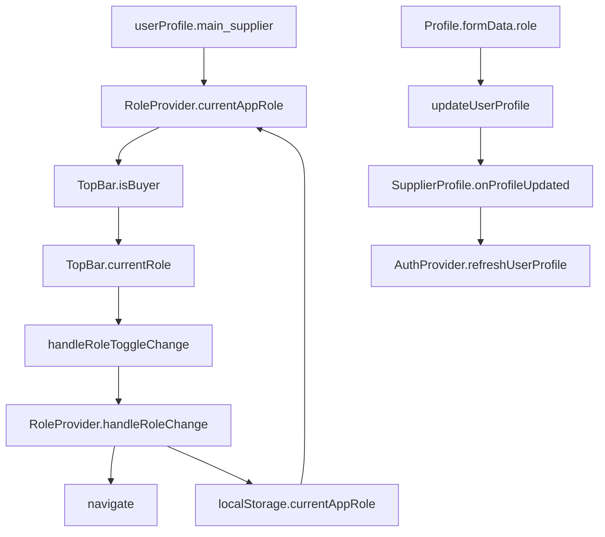

# 🔍 ANÁLISIS PROFUNDO: Problema de Sincronización del Switch de Rol

## 📋 RESUMEN EJECUTIVO

**Problema**: El Switch de rol en TopBar.jsx no se sincroniza correctamente cuando el usuario navega manualmente a URLs o cuando cambia el rol en Profile.jsx.

**Causa Raíz**: Múltiples fuentes de verdad y flujos de sincronización descoordinados entre localStorage, RoleProvider, TopBar y Profile.

## 🚨 PROBLEMAS IDENTIFICADOS

### 1. **MÚLTIPLES FUENTES DE VERDAD**
```jsx
// 📍 RoleProvider.jsx - Fuente 1: localStorage
const getInitialAppRole = () => {
  const storedRole = localStorage.getItem('currentAppRole');
  return storedRole || null;
};

// 📍 RoleProvider.jsx - Fuente 2: userProfile.main_supplier 
const initialRole = userProfile.main_supplier ? 'supplier' : 'buyer';

// 📍 TopBar.jsx - Fuente 3: Estado local del Switch
const [currentRole, setCurrentRole] = useState(() => {
  if (typeof isBuyer === 'boolean') {
    return isBuyer ? 'buyer' : 'supplier';
  }
  return 'buyer';
});

// 📍 Profile.jsx - Fuente 4: formData.role
<ProfileSwitch
  type="role"
  value={formData.role || 'supplier'}
  onChange={(e, newValue) => onFieldChange('role', newValue)}
/>
```

### 2. **FLUJO DE SINCRONIZACIÓN FRAGMENTADO**



**Problema**: Los flujos A→B→C→D y E→F→G→H no están conectados.

### 3. **DESINCRONIZACIÓN EN NAVEGACIÓN MANUAL**

**Escenario problemático**:
1. Usuario es `supplier` (main_supplier=true)
2. localStorage tiene `currentAppRole='supplier'`
3. Usuario navega manualmente a `/buyer/marketplace`
4. RoleProvider actualiza currentAppRole a 'buyer' (línea 153-169)
5. TopBar recibe isBuyer=true
6. TopBar actualiza currentRole a 'buyer'
7. ✅ Switch muestra "Comprador" correctamente

**PERO cuando navega a `/supplier/home`**:
1. RoleProvider actualiza currentAppRole a 'supplier'
2. TopBar recibe isBuyer=false
3. ✅ Switch debería mostrar "Proveedor"
4. ❌ **PROBLEMA**: Si hay delay en la sincronización, el Switch puede mostrar temporalmente el valor incorrecto

### 4. **CAMBIO DE ROL EN PROFILE NO ACTUALIZA SWITCH**

**Flujo actual cuando se cambia rol en Profile**:
```jsx
// 1. Usuario cambia de Proveedor → Comprador en Profile
formData.role = 'buyer'

// 2. Se guarda el perfil
await onUpdateProfile(dataToUpdate)
  ↓
handleUpdateProfile(profileData) // SupplierProfile.jsx
  ↓
updateUserProfile(user.id, profileData) // Actualiza BD
  ↓
onProfileUpdated() // Llama a refreshUserProfile de AuthProvider
  ↓ 
checkUserAndFetchProfile() // AuthProvider refresca userProfile
  ↓
userProfile.main_supplier = false // ✅ BD actualizada
  ↓
RoleProvider detecta cambio en userProfile // ❌ NO SUCEDE automáticamente
  ↓
currentAppRole sigue siendo 'supplier' // ❌ PROBLEMA
  ↓
Switch sigue mostrando "Proveedor" // ❌ DESINCRONIZADO
```

## 🎯 SOLUCIONES PROPUESTAS

### **SOLUCIÓN 1: Crear Hook Centralizado de Sincronización**

```jsx
// 📁 src/shared/hooks/useRoleSync.js
import { useEffect } from 'react';
import { useRole } from '../../infrastructure/providers/RoleProvider';
import { useAuth } from '../../infrastructure/providers/AuthProvider';

export const useRoleSync = () => {
  const { currentAppRole, handleRoleChange } = useRole();
  const { userProfile } = useAuth();

  // Sincronizar role cuando userProfile.main_supplier cambia
  useEffect(() => {
    if (userProfile && userProfile.main_supplier !== undefined) {
      const profileRole = userProfile.main_supplier ? 'supplier' : 'buyer';
      
      // Solo actualizar si hay diferencia
      if (currentAppRole !== profileRole) {
        // Actualizar sin navegación forzada
        handleRoleChange(profileRole, { skipNavigation: true });
      }
    }
  }, [userProfile?.main_supplier, currentAppRole, handleRoleChange]);

  return {
    currentRole: currentAppRole,
    isSync: userProfile ? 
      (userProfile.main_supplier ? 'supplier' : 'buyer') === currentAppRole : 
      true
  };
};
```

### **SOLUCIÓN 2: Mejorar RoleProvider para Detectar Cambios**

```jsx
// 📁 src/infrastructure/providers/RoleProvider.jsx - MEJORA
export const RoleProvider = ({ children }) => {
  // ... código existente ...

  // ✅ NUEVO: Detectar cambios en main_supplier del perfil
  const [lastMainSupplier, setLastMainSupplier] = useState(userProfile?.main_supplier);

  useEffect(() => {
    if (userProfile && userProfile.main_supplier !== lastMainSupplier) {
      setLastMainSupplier(userProfile.main_supplier);
      
      const newRoleFromProfile = userProfile.main_supplier ? 'supplier' : 'buyer';
      
      // Actualizar currentAppRole y localStorage
      if (currentAppRole !== newRoleFromProfile) {
        setCurrentAppRole(newRoleFromProfile);
        try {
          localStorage.setItem('currentAppRole', newRoleFromProfile);
        } catch (e) {}
      }
    }
  }, [userProfile?.main_supplier, lastMainSupplier, currentAppRole]);

  // ... resto del código ...
};
```

### **SOLUCIÓN 3: Simplificar TopBar Switch State**

```jsx
// 📁 src/shared/components/navigation/TopBar/TopBar.jsx - MEJORA
export default function TopBar({
  session,
  isBuyer,
  logoUrl,
  onNavigate,
  onRoleChange,
}) {
  // ❌ ELIMINAR: Estado local del Switch
  // const [currentRole, setCurrentRole] = useState(...)

  // ✅ USAR: Directamente la prop isBuyer como fuente única de verdad
  const currentRole = isBuyer ? 'buyer' : 'supplier';

  const handleRoleToggleChange = (event, newRole) => {
    if (newRole !== null && onRoleChange) {
      onRoleChange(newRole);
    }
  };

  // ... resto del código usando currentRole directamente ...
}
```

### **SOLUCIÓN 4: Mejorar handleRoleChange para Manejar skipNavigation**

```jsx
// 📁 src/infrastructure/providers/RoleProvider.jsx - MEJORA
const handleRoleChange = (newRole, options = {}) => {
  const { skipNavigation = false } = options;
  
  setCurrentAppRole(newRole);
  
  // Persistir en localStorage
  try {
    if (session && session.user) {
      localStorage.setItem('currentAppRole', newRole);
    }
  } catch (e) {}
  
  // Solo navegar si no se especifica skipNavigation
  if (!skipNavigation) {
    setIsRoleSwitching(true);
    if (newRole === 'supplier') {
      navigate('/supplier/home');
    } else {
      navigate('/buyer/marketplace');
    }
  }
};
```

## 🚀 PLAN DE IMPLEMENTACIÓN

### **FASE 1: Refactorización Inmediata** ⚡
1. Simplificar TopBar Switch State (Solución 3)
2. Mejorar handleRoleChange (Solución 4)

### **FASE 2: Sincronización Automática** 🔄
1. Implementar detección de cambios en RoleProvider (Solución 2)
2. Crear hook useRoleSync (Solución 1)

### **FASE 3: Testing y Validación** ✅
1. Probar navegación manual entre rutas
2. Probar cambio de rol en Profile
3. Probar persistencia tras cierre/apertura de navegador

## 🔧 ARCHIVOS A MODIFICAR

1. **RoleProvider.jsx** - Detección de cambios en userProfile
2. **TopBar.jsx** - Simplificación del estado del Switch
3. **useRoleSync.js** - Nuevo hook de sincronización
4. **Profile.jsx** - Integrar useRoleSync
5. **SupplierProfile.jsx** - Opcional: mejorar callback onProfileUpdated

## ✅ RESULTADO ESPERADO

Después de la implementación:
- ✅ Switch siempre refleja el rol actual del usuario
- ✅ Navegación manual actualiza Switch correctamente
- ✅ Cambio de rol en Profile sincroniza Switch inmediatamente
- ✅ Persistencia funciona correctamente tras recargas
- ✅ No hay múltiples fuentes de verdad conflictivas
- ✅ **NUEVO**: Sin parpadeo en el Switch al cargar
- ✅ **NUEVO**: Redirección automática cuando hay conflicto rol/ruta

## 🆕 MEJORAS ADICIONALES IMPLEMENTADAS

### **Eliminación de Parpadeo**
```jsx
// TopBar.jsx - Protección contra parpadeo
const currentRole = isRoleLoading 
  ? null // No mostrar rol durante loading
  : (typeof isBuyer === 'boolean' ? (isBuyer ? 'buyer' : 'supplier') : 'buyer');

// Solo renderizar Switch cuando el rol esté determinado
{currentRole && (
  <Switch value={currentRole} ... />
)}
```

### **Redirección Automática por Conflicto**
```jsx
// RoleProvider.jsx - Nueva lógica de redirección
// Si un SUPPLIER está en ruta de BUYER → redirigir a supplier
if (userIsSupplier && isOnBuyerRoute) {
  navigate('/supplier/home', { replace: true });
}

// Si un BUYER está en ruta de SUPPLIER → redirigir a buyer  
if (!userIsSupplier && isOnSupplierRoute) {
  navigate('/buyer/marketplace', { replace: true });
}
```

## 🚨 CONSIDERACIONES ADICIONALES

### **Performance**
- Los useEffect adicionales son mínimos y solo se ejecutan cuando hay cambios reales
- La sincronización es reactiva, no polling

### **UX**
- Transiciones suaves sin parpadeos
- Estados de loading apropiados
- Consistencia visual

### **Debugging**
- Logs claros para tracking de sincronización
- Estados intermedios observables en React DevTools

---

*Este análisis identifica la causa raíz del problema de sincronización y proporciona soluciones escalables y mantenibles.*
