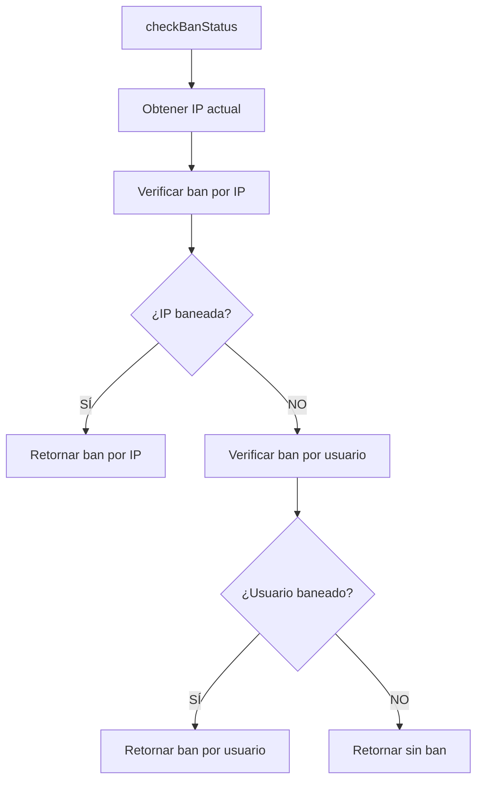

# Sistema de Ban - Sellsi

## Descripción

El sistema de ban de Sellsi es un mecanismo de seguridad que permite suspender usuarios y direcciones IP que violen las políticas de uso de la plataforma. El sistema funciona a nivel de aplicación y bloquea completamente el acceso a todas las funcionalidades de Sellsi.

## Características Principales

### 🔒 **Bloqueo Total**
- Cuando un usuario o IP está baneado, **NO puede acceder a NINGUNA funcionalidad** de la aplicación
- Solo puede ver la página de ban (`/banned`)
- No puede navegar a ninguna otra ruta

### 🎯 **Doble Verificación**
- **Ban por Usuario**: Se verifica el campo `banned` en la tabla `users`
- **Ban por IP**: Se verifica si la IP está en la tabla `banned_ips`
- Si cualquiera de los dos está activo, el usuario es bloqueado

### 🔄 **Verificación Automática**
- El sistema verifica el estado de ban automáticamente al cargar la aplicación
- Usa el componente `BanGuard` que envuelve toda la aplicación
- Funciona tanto para usuarios logueados como para visitantes anónimos

## Estructura del Sistema

### 📁 **Archivos Principales**

```
src/
├── components/
│   └── BanGuard.jsx                 # Componente guardian principal
├── features/
│   ├── ban/
│   │   ├── BanPageView.jsx         # Página principal de ban
│   │   └── index.js                # Export del componente
│   └── ui/
│       └── bannedpage/
│           ├── BannedPageUI.jsx    # Componente UI modular
│           ├── BanInfo.jsx         # Información detallada del ban
│           └── index.js            # Export del componente
├── hooks/
│   └── useBanStatus.js             # Hook para verificar estado de ban
└── services/
    └── banService.js               # Servicio para manejar lógica de ban
```

### 🗄️ **Tablas de Base de Datos**

#### `users` (campos relacionados con ban)
- `banned`: boolean (default: false)
- `banned_at`: timestamp
- `banned_reason`: text
- `last_ip`: text

#### `banned_ips`
- `ip`: text (primary key)
- `banned_at`: timestamp
- `banned_reason`: text
- `banned_by`: uuid (referencia a admin)

## Componentes

### 🛡️ **BanGuard**
Componente que envuelve toda la aplicación y verifica el estado de ban antes de renderizar contenido.

```jsx
<BanGuard>
  <AppContent />
</BanGuard>
```

### 🚫 **BanPageView**
Página principal que se muestra cuando un usuario está baneado.

- **Diseño profesional** con logo de Sellsi
- **Información del ban** (tipo, fecha, motivo)
- **Botón de contacto** con email pre-configurado
- **Responsive** para todos los dispositivos

### 🔧 **useBanStatus Hook**
Hook personalizado para verificar el estado de ban.

```jsx
const { banStatus, isLoading, error } = useBanStatus(userId);
```

**Retorna:**
- `banStatus.isBanned`: boolean
- `banStatus.banType`: 'user' | 'ip'
- `banStatus.reason`: string
- `banStatus.bannedAt`: timestamp

### 🛠️ **banService**
Servicio que maneja toda la lógica de verificación de ban.

**Métodos principales:**
- `checkUserBan(userId)`: Verifica ban por usuario
- `checkIPBan(ip)`: Verifica ban por IP
- `checkBanStatus(userId)`: Verificación completa
- `getCurrentIP()`: Obtiene la IP actual del usuario

## Flujo de Funcionamiento

### 1. **Carga de la Aplicación**
```mermaid
graph TD
    A[Usuario accede a Sellsi] --> B[BanGuard se ejecuta]
    B --> C[useBanStatus verifica ban]
    C --> D[banService.checkBanStatus()]
    D --> E{¿Está baneado?}
    E -->|SÍ| F[Mostrar BanPageView]
    E -->|NO| G[Renderizar aplicación normal]
```

### 2. **Verificación de Ban**


### 3. **Integración con IP Tracking**
- Usa el servicio `ipTrackingService` existente
- Actualiza la IP del usuario automáticamente
- Verifica tanto la IP actual como la IP almacenada

## Configuración

### 🔧 **Integración en App.jsx**

```jsx
import BanGuard from './components/BanGuard';

function App() {
  return (
    <BrowserRouter>
      <BanGuard>
        <AppContent />
      </BanGuard>
    </BrowserRouter>
  );
}
```

### 📧 **Configuración de Email**

El sistema incluye un email pre-configurado para contactar soporte:

```javascript
const handleContactClick = () => {
  const subject = encodeURIComponent('Revisión de cuenta baneada');
  const body = encodeURIComponent(`
    Información del ban:
    - Tipo: ${banStatus.banType}
    - Motivo: ${banStatus.reason}
    - Fecha: ${banStatus.bannedAt}
  `);
  
  window.location.href = `mailto:contacto@sellsi.cl?subject=${subject}&body=${body}`;
};
```

## Seguridad

### 🔐 **Medidas de Seguridad**

1. **Fail-Safe**: Si hay error verificando el ban, permite acceso (evita bloqueos accidentales)
2. **Doble Verificación**: Usuario e IP se verifican independientemente
3. **Actualización Automática**: La IP se actualiza automáticamente al verificar
4. **Bloqueo Total**: No hay forma de bypassear el sistema una vez baneado

### 🚨 **Casos de Uso**

1. **Usuario baneado**: El usuario específico no puede acceder
2. **IP baneada**: Cualquier usuario desde esa IP está bloqueado
3. **Usuario nuevo en IP baneada**: Se crea cuenta pero no puede acceder
4. **Usuario baneado cambia IP**: Sigue bloqueado por ban de usuario

## Testing

### 🧪 **Rutas de Testing**

- `/banned`: Acceso directo a la página de ban (para diseño)
- Modificar directamente la BD para probar funcionalidad

### 🔍 **Verificaciones**

1. **Usuario baneado**: `UPDATE users SET banned = true WHERE user_id = 'xxx'`
2. **IP baneada**: `INSERT INTO banned_ips (ip) VALUES ('xxx.xxx.xxx.xxx')`
3. **Verificar redirección**: Usuario no puede acceder a ninguna ruta
4. **Verificar página**: Página de ban se muestra correctamente

## Mantenimiento

### 📋 **Tareas Regulares**

1. **Monitorear logs** de errores en banService
2. **Revisar emails** de usuarios baneados
3. **Actualizar políticas** de ban según necesidades
4. **Verificar rendimiento** del sistema de verificación

### 🔄 **Actualizaciones Futuras**

- [ ] Sistema de bans temporales (con fecha de expiración)
- [ ] Notificaciones automáticas a admins
- [ ] Dashboard de gestión de bans
- [ ] Logs de auditoría detallados
- [ ] Sistema de appeals/apelaciones

## Contacto

Para cualquier duda sobre el sistema de ban, contactar a **contacto@sellsi.cl**

---

*Sistema implementado el 16 de Julio de 2025*
