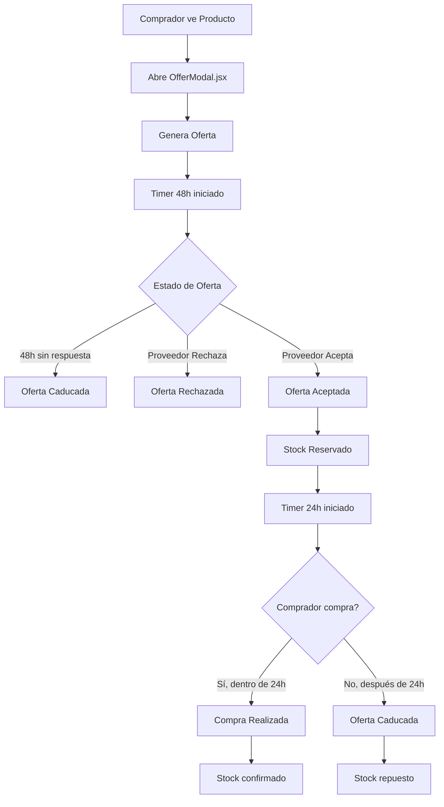

# 🔥 ANÁLISIS SUPER PROFUNDO: SISTEMA DE OFERTAS SELLSI

## 📋 RESUMEN EJECUTIVO

### 🎯 Objetivo del Sistema
Implementar un sistema completo de ofertas donde compradores pueden hacer ofertas a proveedores por productos específicos, con manejo temporal automatizado, control de stock e integración completa con el flujo de compra existente.

### 🚀 Componentes Principales Identificados
1. **OfferModal.jsx** - Modal para crear ofertas (comprador)
2. **BuyerOffer.jsx** - Gestión de ofertas del comprador
3. **SupplierOffer.jsx** - Gestión de ofertas del proveedor
4. **AddToCartModal.jsx** - Modal para agregar productos ofertados al carrito

---

## 🏗️ ARQUITECTURA DEL SISTEMA

### 📊 Diagrama de Flujo del Sistema



### 🔄 Estados del Sistema

#### Estados de Oferta
1. **PENDING** - Esperando respuesta del proveedor (48h)
2. **ACCEPTED** - Proveedor aceptó (24h para comprar)
3. **REJECTED** - Proveedor rechazó
4. **EXPIRED** - Expiró por tiempo
5. **PURCHASED** - Compra realizada
6. **COMPLETED** - Proceso completado

---

## 📝 ESPECIFICACIONES TÉCNICAS DETALLADAS

### 🗄️ ESTRUCTURA DE BASE DE DATOS

#### 1. Tabla `offers` (Nueva)

```sql
CREATE TABLE public.offers (
  id uuid NOT NULL DEFAULT gen_random_uuid(),
  
  -- Información básica
  buyer_id uuid NOT NULL,
  supplier_id uuid NOT NULL,
  product_id uuid NOT NULL,
  
  -- Datos de la oferta
  offered_price numeric NOT NULL,
  offered_quantity integer NOT NULL,
  message text,
  
  -- Estados y tiempos
  status text NOT NULL DEFAULT 'pending' CHECK (
    status IN ('pending', 'accepted', 'rejected', 'expired', 'purchased', 'completed')
  ),
  
  -- Timestamps críticos
  created_at timestamptz DEFAULT now() NOT NULL,
  expires_at timestamptz NOT NULL, -- 48h desde created_at
  accepted_at timestamptz,
  purchase_deadline timestamptz, -- 24h desde accepted_at
  purchased_at timestamptz,
  completed_at timestamptz,
  
  -- Stock management
  stock_reserved boolean DEFAULT false,
  stock_reserved_at timestamptz,
  stock_released_at timestamptz,
  
  -- Tracking
  supplier_response text, -- Mensaje del proveedor
  rejection_reason text,
  expiration_reason text, -- 'timeout_pending' | 'timeout_purchase' | 'manual'
  
  -- Metadata
  metadata jsonb DEFAULT '{}',
  
  CONSTRAINT offers_pkey PRIMARY KEY (id),
  CONSTRAINT offers_buyer_id_fkey FOREIGN KEY (buyer_id) REFERENCES public.users(user_id),
  CONSTRAINT offers_supplier_id_fkey FOREIGN KEY (supplier_id) REFERENCES public.users(user_id),
  CONSTRAINT offers_product_id_fkey FOREIGN KEY (product_id) REFERENCES public.products(productid)
);

-- Índices para performance
CREATE INDEX idx_offers_buyer_status ON public.offers (buyer_id, status);
CREATE INDEX idx_offers_supplier_status ON public.offers (supplier_id, status);
CREATE INDEX idx_offers_product_id ON public.offers (product_id);
CREATE INDEX idx_offers_expires_at ON public.offers (expires_at) WHERE status = 'pending';
CREATE INDEX idx_offers_purchase_deadline ON public.offers (purchase_deadline) WHERE status = 'accepted';
```

#### 2. Tabla `offer_limits` (Nueva - Control de límites)

```sql
CREATE TABLE public.offer_limits (
  id uuid NOT NULL DEFAULT gen_random_uuid(),
  buyer_id uuid NOT NULL,
  supplier_id uuid NOT NULL,
  product_id uuid NOT NULL,
  
  -- Contadores mensuales
  month_year text NOT NULL, -- 'YYYY-MM'
  product_offers_count integer DEFAULT 0, -- Max 2 por producto/mes
  supplier_offers_count integer DEFAULT 0, -- Max 5 por proveedor/mes
  
  created_at timestamptz DEFAULT now(),
  updated_at timestamptz DEFAULT now(),
  
  CONSTRAINT offer_limits_pkey PRIMARY KEY (id),
  CONSTRAINT offer_limits_unique UNIQUE (buyer_id, supplier_id, product_id, month_year),
  CONSTRAINT offer_limits_buyer_fkey FOREIGN KEY (buyer_id) REFERENCES public.users(user_id),
  CONSTRAINT offer_limits_supplier_fkey FOREIGN KEY (supplier_id) REFERENCES public.users(user_id),
  CONSTRAINT offer_limits_product_fkey FOREIGN KEY (product_id) REFERENCES public.products(productid)
);
```

#### 3. Tabla `offered_products` (Nueva - Productos ofertados en carrito)

```sql
CREATE TABLE public.offered_products (
  id uuid NOT NULL DEFAULT gen_random_uuid(),
  
  -- Referencia a la oferta
  offer_id uuid NOT NULL,
  
  -- Datos del producto "virtual" ofertado
  base_product_id uuid NOT NULL,
  offered_price numeric NOT NULL,
  offered_quantity integer NOT NULL,
  
  -- Estado del producto ofertado
  is_in_cart boolean DEFAULT false,
  cart_id uuid,
  order_id uuid,
  
  -- Timestamps
  created_at timestamptz DEFAULT now(),
  added_to_cart_at timestamptz,
  purchased_at timestamptz,
  
  CONSTRAINT offered_products_pkey PRIMARY KEY (id),
  CONSTRAINT offered_products_offer_fkey FOREIGN KEY (offer_id) REFERENCES public.offers(id) ON DELETE CASCADE,
  CONSTRAINT offered_products_base_product_fkey FOREIGN KEY (base_product_id) REFERENCES public.products(productid),
  CONSTRAINT offered_products_cart_fkey FOREIGN KEY (cart_id) REFERENCES public.carts(cart_id),
  CONSTRAINT offered_products_order_fkey FOREIGN KEY (order_id) REFERENCES public.orders(id)
);
```

#### 4. Modificaciones a tablas existentes

```sql
-- Agregar campo tipo de producto a cart_items
ALTER TABLE public.cart_items 
ADD COLUMN product_type text DEFAULT 'regular' CHECK (
  product_type IN ('regular', 'offered')
);
ADD COLUMN offer_id uuid REFERENCES public.offers(id);

-- Agregar campo a orders para tracking de ofertas
ALTER TABLE public.orders 
ADD COLUMN contains_offers boolean DEFAULT false;
ADD COLUMN offer_ids uuid[];

-- Función para auto-expirar ofertas
CREATE OR REPLACE FUNCTION expire_pending_offers()
RETURNS void AS $$
BEGIN
  -- Expirar ofertas pendientes después de 48h
  UPDATE public.offers 
  SET 
    status = 'expired',
    expiration_reason = 'timeout_pending',
    updated_at = now()
  WHERE 
    status = 'pending' 
    AND expires_at < now();
    
  -- Expirar ofertas aceptadas después de 24h sin compra
  UPDATE public.offers 
  SET 
    status = 'expired',
    expiration_reason = 'timeout_purchase',
    stock_reserved = false,
    stock_released_at = now(),
    updated_at = now()
  WHERE 
    status = 'accepted' 
    AND purchase_deadline < now();
    
  -- Reponer stock de ofertas expiradas
  -- (Esto se manejará en el backend con triggers)
END;
$$ LANGUAGE plpgsql;
```

---

## 🎨 COMPONENTES FRONTEND

### 1. **OfferModal.jsx** (Nuevo)

```jsx
import React, { useState, useEffect } from 'react';
import {
  Dialog,
  DialogTitle,
  DialogContent,
  DialogActions,
  TextField,
  Button,
  Box,
  Typography,
  Alert,
  CircularProgress
} from '@mui/material';
import { useOfferStore } from '../stores/offerStore';
import { useAuthStore } from '../stores/authStore';

const OfferModal = ({ open, onClose, product, supplier }) => {
  const [offeredPrice, setOfferedPrice] = useState('');
  const [offeredQuantity, setOfferedQuantity] = useState(1);
  const [message, setMessage] = useState('');
  const [isSubmitting, setIsSubmitting] = useState(false);
  const [errors, setErrors] = useState({});
  
  const { createOffer, checkOfferLimits } = useOfferStore();
  const { user } = useAuthStore();
  
  // Validar límites al abrir modal
  useEffect(() => {
    if (open && product && user) {
      checkOfferLimits(user.user_id, supplier.user_id, product.productid);
    }
  }, [open, product, user]);
  
  const handleSubmit = async () => {
    setIsSubmitting(true);
    setErrors({});
    
    try {
      // Validaciones
      const validationErrors = validateOffer();
      if (Object.keys(validationErrors).length > 0) {
        setErrors(validationErrors);
        return;
      }
      
      // Crear oferta
      const offerData = {
        buyer_id: user.user_id,
        supplier_id: supplier.user_id,
        product_id: product.productid,
        offered_price: parseFloat(offeredPrice),
        offered_quantity: parseInt(offeredQuantity),
        message
      };
      
      await createOffer(offerData);
      
      // Cerrar modal y mostrar éxito
      onClose();
      // Mostrar notificación de éxito
      
    } catch (error) {
      setErrors({ submit: error.message });
    } finally {
      setIsSubmitting(false);
    }
  };
  
  const validateOffer = () => {
    const errors = {};
    
    if (!offeredPrice || offeredPrice <= 0) {
      errors.price = 'Precio debe ser mayor a 0';
    }
    
    if (!offeredQuantity || offeredQuantity <= 0) {
      errors.quantity = 'Cantidad debe ser mayor a 0';
    }
    
    if (offeredQuantity > product.productqty) {
      errors.quantity = 'Cantidad no puede exceder el stock disponible';
    }
    
    return errors;
  };
  
  return (
    <Dialog open={open} onClose={onClose} maxWidth="sm" fullWidth>
      <DialogTitle>
        Hacer Oferta - {product?.productnm}
      </DialogTitle>
      
      <DialogContent>
        <Box sx={{ display: 'flex', flexDirection: 'column', gap: 2, mt: 1 }}>
          {/* Información del producto */}
          <Box sx={{ p: 2, bgcolor: 'grey.50', borderRadius: 1 }}>
            <Typography variant="body2" color="text.secondary">
              Precio actual: ${product?.price?.toLocaleString()}
            </Typography>
            <Typography variant="body2" color="text.secondary">
              Stock disponible: {product?.productqty} unidades
            </Typography>
          </Box>
          
          {/* Campos de la oferta */}
          <TextField
            label="Precio Ofertado"
            type="number"
            value={offeredPrice}
            onChange={(e) => setOfferedPrice(e.target.value)}
            error={!!errors.price}
            helperText={errors.price}
            InputProps={{
              startAdornment: <Typography>$</Typography>
            }}
            fullWidth
          />
          
          <TextField
            label="Cantidad"
            type="number"
            value={offeredQuantity}
            onChange={(e) => setOfferedQuantity(e.target.value)}
            error={!!errors.quantity}
            helperText={errors.quantity}
            inputProps={{ min: 1, max: product?.productqty }}
            fullWidth
          />
          
          <TextField
            label="Mensaje (opcional)"
            multiline
            rows={3}
            value={message}
            onChange={(e) => setMessage(e.target.value)}
            placeholder="Explica tu oferta al proveedor..."
            fullWidth
          />
          
          {errors.submit && (
            <Alert severity="error">{errors.submit}</Alert>
          )}
        </Box>
      </DialogContent>
      
      <DialogActions>
        <Button onClick={onClose} disabled={isSubmitting}>
          Cancelar
        </Button>
        <Button 
          onClick={handleSubmit} 
          variant="contained" 
          disabled={isSubmitting}
        >
          {isSubmitting ? <CircularProgress size={20} /> : 'Enviar Oferta'}
        </Button>
      </DialogActions>
    </Dialog>
  );
};

export default OfferModal;
```

### 2. **BuyerOffer.jsx** (Nuevo)

```jsx
import React, { useState, useEffect } from 'react';
import {
  Card,
  CardContent,
  Typography,
  Chip,
  Button,
  Box,
  Grid,
  Avatar,
  LinearProgress
} from '@mui/material';
import { Timer, ShoppingCart, Cancel } from '@mui/icons-material';
import { useOfferStore } from '../stores/offerStore';
import { useAuthStore } from '../stores/authStore';
import Timer from '../components/Timer';
import AddToCartModal from '../components/AddToCartModal';

const BuyerOffer = () => {
  const [selectedOffer, setSelectedOffer] = useState(null);
  const [cartModalOpen, setCartModalOpen] = useState(false);
  
  const { buyerOffers, loadBuyerOffers, cancelOffer } = useOfferStore();
  const { user } = useAuthStore();
  
  useEffect(() => {
    if (user) {
      loadBuyerOffers(user.user_id);
    }
  }, [user]);
  
  const getStatusConfig = (offer) => {
    switch (offer.status) {
      case 'pending':
        return {
          color: 'warning',
          label: 'Pendiente',
          description: 'Esperando respuesta del proveedor'
        };
      case 'accepted':
        return {
          color: 'success',
          label: 'Aceptada',
          description: 'Tienes 24h para agregar al carrito'
        };
      case 'rejected':
        return {
          color: 'error',
          label: 'Rechazada',
          description: offer.rejection_reason || 'Rechazada por el proveedor'
        };
      case 'expired':
        return {
          color: 'default',
          label: 'Caducada',
          description: getExpirationMessage(offer)
        };
      case 'purchased':
        return {
          color: 'info',
          label: 'Compra Realizada',
          description: 'Producto agregado al carrito y comprado'
        };
      default:
        return {
          color: 'default',
          label: 'Desconocido',
          description: ''
        };
    }
  };
  
  const getExpirationMessage = (offer) => {
    if (offer.expiration_reason === 'timeout_pending') {
      return 'Expiró esperando respuesta (48h)';
    } else if (offer.expiration_reason === 'timeout_purchase') {
      return 'Expiró sin completar compra (24h)';
    }
    return 'Oferta expirada';
  };
  
  const calculateTimeRemaining = (offer) => {
    const now = new Date();
    
    if (offer.status === 'pending') {
      const expiresAt = new Date(offer.expires_at);
      return Math.max(0, Math.floor((expiresAt - now) / 1000));
    } else if (offer.status === 'accepted') {
      const deadline = new Date(offer.purchase_deadline);
      return Math.max(0, Math.floor((deadline - now) / 1000));
    }
    
    return 0;
  };
  
  const handleAddToCart = (offer) => {
    setSelectedOffer(offer);
    setCartModalOpen(true);
  };
  
  const handleCancelOffer = async (offerId) => {
    try {
      await cancelOffer(offerId);
      // Recargar ofertas
      loadBuyerOffers(user.user_id);
    } catch (error) {
      console.error('Error al cancelar oferta:', error);
    }
  };
  
  return (
    <Box sx={{ p: 3 }}>
      <Typography variant="h4" gutterBottom>
        Mis Ofertas
      </Typography>
      
      <Grid container spacing={2}>
        {buyerOffers.map((offer) => {
          const statusConfig = getStatusConfig(offer);
          const timeRemaining = calculateTimeRemaining(offer);
          
          return (
            <Grid item xs={12} md={6} lg={4} key={offer.id}>
              <Card>
                <CardContent>
                  {/* Header con producto */}
                  <Box sx={{ display: 'flex', alignItems: 'center', mb: 2 }}>
                    <Avatar
                      src={offer.product?.image}
                      sx={{ width: 60, height: 60, mr: 2 }}
                    />
                    <Box sx={{ flex: 1 }}>
                      <Typography variant="h6" noWrap>
                        {offer.product?.productnm}
                      </Typography>
                      <Typography variant="body2" color="text.secondary">
                        {offer.supplier?.user_nm}
                      </Typography>
                    </Box>
                  </Box>
                  
                  {/* Estado */}
                  <Chip
                    label={statusConfig.label}
                    color={statusConfig.color}
                    size="small"
                    sx={{ mb: 1 }}
                  />
                  
                  {/* Detalles de la oferta */}
                  <Box sx={{ mb: 2 }}>
                    <Typography variant="body2">
                      <strong>Precio ofertado:</strong> ${offer.offered_price.toLocaleString()}
                    </Typography>
                    <Typography variant="body2">
                      <strong>Cantidad:</strong> {offer.offered_quantity} unidades
                    </Typography>
                    <Typography variant="body2" color="text.secondary">
                      {statusConfig.description}
                    </Typography>
                  </Box>
                  
                  {/* Timer para estados activos */}
                  {(offer.status === 'pending' || offer.status === 'accepted') && (
                    <Box sx={{ mb: 2 }}>
                      <Timer timer={timeRemaining} />
                    </Box>
                  )}
                  
                  {/* Acciones */}
                  <Box sx={{ display: 'flex', gap: 1 }}>
                    {offer.status === 'accepted' && (
                      <Button
                        variant="contained"
                        startIcon={<ShoppingCart />}
                        onClick={() => handleAddToCart(offer)}
                        size="small"
                      >
                        Agregar al Carrito
                      </Button>
                    )}
                    
                    {offer.status === 'pending' && (
                      <Button
                        variant="outlined"
                        startIcon={<Cancel />}
                        onClick={() => handleCancelOffer(offer.id)}
                        size="small"
                        color="error"
                      >
                        Cancelar
                      </Button>
                    )}
                  </Box>
                </CardContent>
              </Card>
            </Grid>
          );
        })}
      </Grid>
      
      {/* Modal para agregar al carrito */}
      <AddToCartModal
        open={cartModalOpen}
        onClose={() => setCartModalOpen(false)}
        offer={selectedOffer}
      />
    </Box>
  );
};

export default BuyerOffer;
```

### 3. **SupplierOffer.jsx** (Nuevo)

```jsx
import React, { useState, useEffect } from 'react';
import {
  Card,
  CardContent,
  Typography,
  Chip,
  Button,
  Box,
  Grid,
  Avatar,
  Dialog,
  DialogTitle,
  DialogContent,
  DialogActions,
  TextField
} from '@mui/material';
import { Check, Close, Timer } from '@mui/icons-material';
import { useOfferStore } from '../stores/offerStore';
import { useAuthStore } from '../stores/authStore';
import Timer from '../components/Timer';

const SupplierOffer = () => {
  const [responseModalOpen, setResponseModalOpen] = useState(false);
  const [selectedOffer, setSelectedOffer] = useState(null);
  const [responseType, setResponseType] = useState(''); // 'accept' | 'reject'
  const [responseMessage, setResponseMessage] = useState('');
  
  const { supplierOffers, loadSupplierOffers, respondToOffer } = useOfferStore();
  const { user } = useAuthStore();
  
  useEffect(() => {
    if (user) {
      loadSupplierOffers(user.user_id);
    }
  }, [user]);
  
  const getStatusConfig = (offer) => {
    switch (offer.status) {
      case 'pending':
        return {
          color: 'warning',
          label: 'Pendiente',
          description: 'Nueva oferta recibida'
        };
      case 'accepted':
        return {
          color: 'success',
          label: 'Aceptada',
          description: 'Esperando que el comprador complete la compra'
        };
      case 'rejected':
        return {
          color: 'error',
          label: 'Rechazada',
          description: 'Oferta rechazada'
        };
      case 'expired':
        return {
          color: 'default',
          label: 'Caducada',
          description: 'Oferta expirada'
        };
      case 'purchased':
        return {
          color: 'info',
          label: 'Compra Realizada',
          description: 'El comprador completó la compra'
        };
      default:
        return {
          color: 'default',
          label: 'Desconocido',
          description: ''
        };
    }
  };
  
  const calculateTimeRemaining = (offer) => {
    if (offer.status !== 'pending') return 0;
    
    const now = new Date();
    const expiresAt = new Date(offer.expires_at);
    return Math.max(0, Math.floor((expiresAt - now) / 1000));
  };
  
  const handleResponse = (offer, type) => {
    setSelectedOffer(offer);
    setResponseType(type);
    setResponseMessage('');
    setResponseModalOpen(true);
  };
  
  const submitResponse = async () => {
    try {
      await respondToOffer(selectedOffer.id, {
        action: responseType,
        message: responseMessage
      });
      
      setResponseModalOpen(false);
      loadSupplierOffers(user.user_id);
    } catch (error) {
      console.error('Error al responder oferta:', error);
    }
  };
  
  return (
    <Box sx={{ p: 3 }}>
      <Typography variant="h4" gutterBottom>
        Ofertas Recibidas
      </Typography>
      
      <Grid container spacing={2}>
        {supplierOffers.map((offer) => {
          const statusConfig = getStatusConfig(offer);
          const timeRemaining = calculateTimeRemaining(offer);
          
          return (
            <Grid item xs={12} md={6} lg={4} key={offer.id}>
              <Card>
                <CardContent>
                  {/* Header con comprador */}
                  <Box sx={{ display: 'flex', alignItems: 'center', mb: 2 }}>
                    <Avatar sx={{ width: 40, height: 40, mr: 2 }}>
                      {offer.buyer?.user_nm?.charAt(0)}
                    </Avatar>
                    <Box sx={{ flex: 1 }}>
                      <Typography variant="h6">
                        {offer.buyer?.user_nm}
                      </Typography>
                      <Typography variant="body2" color="text.secondary">
                        {offer.product?.productnm}
                      </Typography>
                    </Box>
                  </Box>
                  
                  {/* Estado */}
                  <Chip
                    label={statusConfig.label}
                    color={statusConfig.color}
                    size="small"
                    sx={{ mb: 1 }}
                  />
                  
                  {/* Detalles de la oferta */}
                  <Box sx={{ mb: 2 }}>
                    <Typography variant="body2">
                      <strong>Precio ofertado:</strong> ${offer.offered_price.toLocaleString()}
                    </Typography>
                    <Typography variant="body2">
                      <strong>Precio actual:</strong> ${offer.product?.price.toLocaleString()}
                    </Typography>
                    <Typography variant="body2">
                      <strong>Cantidad:</strong> {offer.offered_quantity} unidades
                    </Typography>
                    {offer.message && (
                      <Typography variant="body2" sx={{ mt: 1, fontStyle: 'italic' }}>
                        "{offer.message}"
                      </Typography>
                    )}
                  </Box>
                  
                  {/* Timer para ofertas pendientes */}
                  {offer.status === 'pending' && (
                    <Box sx={{ mb: 2 }}>
                      <Timer timer={timeRemaining} />
                    </Box>
                  )}
                  
                  {/* Acciones */}
                  {offer.status === 'pending' && (
                    <Box sx={{ display: 'flex', gap: 1 }}>
                      <Button
                        variant="contained"
                        color="success"
                        startIcon={<Check />}
                        onClick={() => handleResponse(offer, 'accept')}
                        size="small"
                      >
                        Aceptar
                      </Button>
                      <Button
                        variant="outlined"
                        color="error"
                        startIcon={<Close />}
                        onClick={() => handleResponse(offer, 'reject')}
                        size="small"
                      >
                        Rechazar
                      </Button>
                    </Box>
                  )}
                </CardContent>
              </Card>
            </Grid>
          );
        })}
      </Grid>
      
      {/* Modal de respuesta */}
      <Dialog open={responseModalOpen} onClose={() => setResponseModalOpen(false)}>
        <DialogTitle>
          {responseType === 'accept' ? 'Aceptar Oferta' : 'Rechazar Oferta'}
        </DialogTitle>
        <DialogContent>
          <TextField
            label="Mensaje (opcional)"
            multiline
            rows={3}
            value={responseMessage}
            onChange={(e) => setResponseMessage(e.target.value)}
            placeholder={
              responseType === 'accept' 
                ? 'Mensaje de confirmación...' 
                : 'Motivo del rechazo...'
            }
            fullWidth
            sx={{ mt: 1 }}
          />
        </DialogContent>
        <DialogActions>
          <Button onClick={() => setResponseModalOpen(false)}>
            Cancelar
          </Button>
          <Button onClick={submitResponse} variant="contained">
            {responseType === 'accept' ? 'Aceptar Oferta' : 'Rechazar Oferta'}
          </Button>
        </DialogActions>
      </Dialog>
    </Box>
  );
};

export default SupplierOffer;
```

---

## 🏪 STORE DE ESTADO (Zustand)

### **offerStore.js** (Nuevo)

```javascript
import { create } from 'zustand';
import { supabase } from '../config/supabase';

export const useOfferStore = create((set, get) => ({
  // Estado
  buyerOffers: [],
  supplierOffers: [],
  offerLimits: null,
  loading: false,
  error: null,
  
  // Acciones para compradores
  createOffer: async (offerData) => {
    set({ loading: true, error: null });
    
    try {
      // Validar límites antes de crear
      const canCreate = await get().validateOfferLimits(
        offerData.buyer_id,
        offerData.supplier_id,
        offerData.product_id
      );
      
      if (!canCreate.allowed) {
        throw new Error(canCreate.reason);
      }
      
      // Calcular timestamps
      const now = new Date();
      const expiresAt = new Date(now.getTime() + (48 * 60 * 60 * 1000)); // 48h
      
      // Crear oferta
      const { data: offer, error } = await supabase
        .from('offers')
        .insert([{
          ...offerData,
          expires_at: expiresAt.toISOString(),
          status: 'pending'
        }])
        .select(`
          *,
          product:products(*),
          supplier:users!supplier_id(*),
          buyer:users!buyer_id(*)
        `)
        .single();
        
      if (error) throw error;
      
      // Actualizar límites
      await get().updateOfferLimits(
        offerData.buyer_id,
        offerData.supplier_id,
        offerData.product_id
      );
      
      // Agregar a estado local
      set(state => ({
        buyerOffers: [offer, ...state.buyerOffers],
        loading: false
      }));
      
      // Crear notificación para proveedor
      await get().createOfferNotification(offer, 'new_offer');
      
      return offer;
      
    } catch (error) {
      set({ error: error.message, loading: false });
      throw error;
    }
  },
  
  loadBuyerOffers: async (buyerId) => {
    set({ loading: true });
    
    try {
      const { data, error } = await supabase
        .from('offers')
        .select(`
          *,
          product:products(*),
          supplier:users!supplier_id(*)
        `)
        .eq('buyer_id', buyerId)
        .order('created_at', { ascending: false });
        
      if (error) throw error;
      
      set({ buyerOffers: data, loading: false });
      
    } catch (error) {
      set({ error: error.message, loading: false });
    }
  },
  
  loadSupplierOffers: async (supplierId) => {
    set({ loading: true });
    
    try {
      const { data, error } = await supabase
        .from('offers')
        .select(`
          *,
          product:products(*),
          buyer:users!buyer_id(*)
        `)
        .eq('supplier_id', supplierId)
        .order('created_at', { ascending: false });
        
      if (error) throw error;
      
      set({ supplierOffers: data, loading: false });
      
    } catch (error) {
      set({ error: error.message, loading: false });
    }
  },
  
  respondToOffer: async (offerId, response) => {
    try {
      const updates = {
        updated_at: new Date().toISOString()
      };
      
      if (response.action === 'accept') {
        const acceptedAt = new Date();
        const purchaseDeadline = new Date(acceptedAt.getTime() + (24 * 60 * 60 * 1000));
        
        updates.status = 'accepted';
        updates.accepted_at = acceptedAt.toISOString();
        updates.purchase_deadline = purchaseDeadline.toISOString();
        updates.supplier_response = response.message;
        updates.stock_reserved = true;
        updates.stock_reserved_at = acceptedAt.toISOString();
        
      } else if (response.action === 'reject') {
        updates.status = 'rejected';
        updates.rejection_reason = response.message;
      }
      
      const { data, error } = await supabase
        .from('offers')
        .update(updates)
        .eq('id', offerId)
        .select()
        .single();
        
      if (error) throw error;
      
      // Si se acepta, reservar stock
      if (response.action === 'accept') {
        await get().reserveStock(data.product_id, data.offered_quantity);
      }
      
      // Actualizar estado local
      set(state => ({
        supplierOffers: state.supplierOffers.map(offer =>
          offer.id === offerId ? { ...offer, ...updates } : offer
        )
      }));
      
      // Crear notificación para comprador
      await get().createOfferNotification(data, 
        response.action === 'accept' ? 'offer_accepted' : 'offer_rejected'
      );
      
    } catch (error) {
      throw error;
    }
  },
  
  addOfferedProductToCart: async (offerId) => {
    try {
      // Obtener datos de la oferta
      const { data: offer, error: offerError } = await supabase
        .from('offers')
        .select(`
          *,
          product:products(*)
        `)
        .eq('id', offerId)
        .single();
        
      if (offerError) throw offerError;
      
      if (offer.status !== 'accepted') {
        throw new Error('Solo se pueden agregar ofertas aceptadas al carrito');
      }
      
      // Crear producto ofertado en el carrito
      const cartItem = {
        ...offer.product,
        id: `offered_${offerId}`,
        price: offer.offered_price,
        quantity: offer.offered_quantity,
        product_type: 'offered',
        offer_id: offerId,
        isOffered: true,
        maxStock: offer.offered_quantity, // Cantidad fija
        name: `${offer.product.productnm} (Ofertado)`
      };
      
      // Usar cartStore existente para agregar
      const cartStore = useCartStore.getState();
      await cartStore.addItem(cartItem, offer.offered_quantity);
      
      // Marcar oferta como agregada al carrito
      await supabase
        .from('offers')
        .update({
          status: 'in_cart',
          updated_at: new Date().toISOString()
        })
        .eq('id', offerId);
        
    } catch (error) {
      throw error;
    }
  },
  
  // Funciones auxiliares
  validateOfferLimits: async (buyerId, supplierId, productId) => {
    const monthYear = new Date().toISOString().substring(0, 7); // YYYY-MM
    
    const { data, error } = await supabase
      .from('offer_limits')
      .select('*')
      .eq('buyer_id', buyerId)
      .eq('month_year', monthYear);
      
    if (error) throw error;
    
    // Verificar límite por producto (2 por mes)
    const productLimit = data.find(limit => 
      limit.product_id === productId && limit.supplier_id === supplierId
    );
    
    if (productLimit && productLimit.product_offers_count >= 2) {
      return {
        allowed: false,
        reason: 'Has alcanzado el límite de 2 ofertas por producto al mes'
      };
    }
    
    // Verificar límite por proveedor (5 por mes)
    const supplierTotal = data
      .filter(limit => limit.supplier_id === supplierId)
      .reduce((sum, limit) => sum + limit.supplier_offers_count, 0);
      
    if (supplierTotal >= 5) {
      return {
        allowed: false,
        reason: 'Has alcanzado el límite de 5 ofertas por proveedor al mes'
      };
    }
    
    return { allowed: true };
  },
  
  updateOfferLimits: async (buyerId, supplierId, productId) => {
    const monthYear = new Date().toISOString().substring(0, 7);
    
    // Upsert límites
    await supabase
      .from('offer_limits')
      .upsert({
        buyer_id: buyerId,
        supplier_id: supplierId,
        product_id: productId,
        month_year: monthYear,
        product_offers_count: 1,
        supplier_offers_count: 1
      }, {
        onConflict: 'buyer_id,supplier_id,product_id,month_year',
        count: 'exact'
      });
  },
  
  reserveStock: async (productId, quantity) => {
    // Reservar stock temporalmente
    // Esto podría implementarse con un campo reserved_stock en products
    // o con una tabla separada de stock reservado
  },
  
  createOfferNotification: async (offer, type) => {
    const notifications = {
      new_offer: {
        user_id: offer.supplier_id,
        title: 'Nueva oferta recibida',
        body: `${offer.buyer.user_nm} hizo una oferta por ${offer.product.productnm}`,
        type: 'offer_received'
      },
      offer_accepted: {
        user_id: offer.buyer_id,
        title: 'Oferta aceptada',
        body: `Tu oferta por ${offer.product.productnm} fue aceptada`,
        type: 'offer_accepted'
      },
      offer_rejected: {
        user_id: offer.buyer_id,
        title: 'Oferta rechazada',
        body: `Tu oferta por ${offer.product.productnm} fue rechazada`,
        type: 'offer_rejected'
      }
    };
    
    const notification = notifications[type];
    if (notification) {
      await supabase
        .from('notifications')
        .insert([{
          ...notification,
          order_id: offer.id,
          metadata: { offer_id: offer.id }
        }]);
    }
  }
}));
```

---

## ⚙️ LÓGICA DE NEGOCIO CRÍTICA

### 1. **Sistema de Timers**

```javascript
// hooks/useOfferTimer.js
import { useState, useEffect } from 'react';

export const useOfferTimer = (offer) => {
  const [timeRemaining, setTimeRemaining] = useState(0);
  
  useEffect(() => {
    if (!offer) return;
    
    const calculateTime = () => {
      const now = new Date();
      let targetDate;
      
      if (offer.status === 'pending') {
        targetDate = new Date(offer.expires_at);
      } else if (offer.status === 'accepted') {
        targetDate = new Date(offer.purchase_deadline);
      } else {
        return 0;
      }
      
      const diff = Math.max(0, Math.floor((targetDate - now) / 1000));
      return diff;
    };
    
    setTimeRemaining(calculateTime());
    
    const interval = setInterval(() => {
      const remaining = calculateTime();
      setTimeRemaining(remaining);
      
      if (remaining === 0) {
        // Timer expirado - trigger update
        // Esto podría disparar una función para verificar estado
      }
    }, 1000);
    
    return () => clearInterval(interval);
  }, [offer]);
  
  return timeRemaining;
};
```

### 2. **Integración con Carrito Existente**

```javascript
// Modificaciones a cartStore.facade.js
const addItem = async (product, quantity = 1) => {
  const state = get();
  
  // Verificar si es un producto ofertado
  if (product.product_type === 'offered' || product.isOffered) {
    // Manejar producto ofertado
    return await addOfferedItem(product, quantity, set, get);
  }
  
  // Lógica existente para productos regulares
  if (state.userId && state.cartId && state.isBackendSynced) {
    return await addItemWithBackend(product, quantity, set, get);
  }
  
  return addItemLocal(product, quantity, set, get, historyStore, debouncedSave);
};

const addOfferedItem = async (product, quantity, set, get) => {
  const state = get();
  
  // Validar que la oferta sigue activa
  const { data: offer, error } = await supabase
    .from('offers')
    .select('*')
    .eq('id', product.offer_id)
    .eq('status', 'accepted')
    .single();
    
  if (error || !offer) {
    throw new Error('La oferta ya no está disponible');
  }
  
  // Verificar que no exceda tiempo límite
  const now = new Date();
  const deadline = new Date(offer.purchase_deadline);
  
  if (now > deadline) {
    throw new Error('El tiempo para agregar esta oferta al carrito ha expirado');
  }
  
  // Agregar al carrito con metadata especial
  const cartItem = {
    ...product,
    quantity,
    price: offer.offered_price,
    maxStock: offer.offered_quantity,
    metadata: {
      isOffered: true,
      offer_id: offer.id,
      expiry_time: offer.purchase_deadline
    }
  };
  
  set(state => ({
    items: [...state.items, cartItem]
  }));
  
  // Actualizar estado de oferta
  await supabase
    .from('offers')
    .update({
      status: 'in_cart',
      updated_at: new Date().toISOString()
    })
    .eq('id', offer.id);
    
  return true;
};
```

### 3. **Modificaciones al Sistema de Checkout**

```javascript
// Modificaciones a checkoutService.js
const processOrder = async (orderData) => {
  // Separar items regulares de items ofertados
  const regularItems = orderData.items.filter(item => !item.metadata?.isOffered);
  const offeredItems = orderData.items.filter(item => item.metadata?.isOffered);
  
  // Procesar ofertas antes de crear orden
  for (const item of offeredItems) {
    await processOfferedItem(item);
  }
  
  // Crear orden con metadata de ofertas
  const order = await createOrder({
    ...orderData,
    contains_offers: offeredItems.length > 0,
    offer_ids: offeredItems.map(item => item.metadata.offer_id)
  });
  
  return order;
};

const processOfferedItem = async (item) => {
  const offerId = item.metadata.offer_id;
  
  // Marcar oferta como comprada
  await supabase
    .from('offers')
    .update({
      status: 'purchased',
      purchased_at: new Date().toISOString(),
      updated_at: new Date().toISOString()
    })
    .eq('id', offerId);
    
  // NO descontar stock adicional (ya fue reservado)
  // Solo confirmar la reserva
};
```

---

## 🔄 INTEGRACIÓN CON KHIPU

### Modificaciones a las Edge Functions

```javascript
// supabase/functions/create-khipu-payment/index.ts
// Agregar lógica para manejar productos ofertados

const processOrderItems = (items) => {
  return items.map(item => {
    if (item.metadata?.isOffered) {
      return {
        ...item,
        description: `${item.name} (OFERTADO)`,
        special_handling: true,
        offer_id: item.metadata.offer_id
      };
    }
    return item;
  });
};
```

---

## 📱 COMPONENTES DE UI ADICIONALES

### 1. **Tag "Ofertado"**

```jsx
// components/OfferedTag.jsx
import { Chip } from '@mui/material';
import { LocalOffer } from '@mui/icons-material';

const OfferedTag = ({ size = 'small', sx = {} }) => (
  <Chip
    icon={<LocalOffer />}
    label="Ofertado"
    size={size}
    sx={{
      backgroundColor: '#e3f2fd',
      color: '#1976d2',
      fontWeight: 600,
      '& .MuiChip-icon': {
        color: '#1976d2'
      },
      ...sx
    }}
  />
);

export default OfferedTag;
```

### 2. **Modificaciones a CartItem.jsx**

```jsx
// Agregar identificación visual para productos ofertados
const CartItem = ({ item, ...props }) => {
  const isOffered = item.metadata?.isOffered || item.product_type === 'offered';
  
  return (
    <Card sx={{ mb: 2, border: isOffered ? '2px solid #1976d2' : 'none' }}>
      <CardContent>
        {/* Header con nombre y tag */}
        <Box sx={{ display: 'flex', alignItems: 'center', mb: 1 }}>
          <Typography variant="h6" sx={{ flex: 1 }}>
            {item.name}
          </Typography>
          {isOffered && <OfferedTag />}
        </Box>
        
        {/* Precio con indicación especial para ofertas */}
        <Typography variant="body1">
          Precio: ${item.price.toLocaleString()}
          {isOffered && (
            <Typography component="span" variant="caption" sx={{ ml: 1, color: 'primary.main' }}>
              (Precio ofertado)
            </Typography>
          )}
        </Typography>
        
        {/* Resto del componente... */}
      </CardContent>
    </Card>
  );
};
```

---

## 🔧 TAREAS TÉCNICAS DE IMPLEMENTACIÓN

### Fase 1: Base de Datos (1-2 días)
1. ✅ Crear tablas `offers`, `offer_limits`, `offered_products`
2. ✅ Crear triggers para auto-expiración
3. ✅ Crear índices para performance
4. ✅ Crear funciones de utilidad SQL

### Fase 2: Backend/API (2-3 días)
1. ✅ Crear Edge Functions para ofertas
2. ✅ Implementar validaciones de negocio
3. ✅ Integrar sistema de notificaciones
4. ✅ Modificar funciones de checkout existentes

### Fase 3: Stores y Estado (2 días)
1. ✅ Crear `offerStore.js`
2. ✅ Modificar `cartStore` para productos ofertados
3. ✅ Implementar hooks de timers
4. ✅ Integrar con `authStore`

### Fase 4: Componentes UI (3-4 días)
1. ✅ Crear `OfferModal.jsx`
2. ✅ Crear `BuyerOffer.jsx`
3. ✅ Crear `SupplierOffer.jsx`
4. ✅ Modificar `CartItem.jsx`, `PaymentMethod.jsx`
5. ✅ Crear componentes auxiliares (`Timer`, `OfferedTag`)

### Fase 5: Integración (2-3 días)
1. ✅ Integrar con checkout existente
2. ✅ Modificar Edge Functions de Khipu
3. ✅ Integrar sistema de notificaciones
4. ✅ Testing end-to-end

### Fase 6: Testing y Refinamiento (2-3 días)
1. ✅ Testing de timers
2. ✅ Testing de límites
3. ✅ Testing de stock management
4. ✅ Performance testing
5. ✅ UI/UX refinamiento

---

## ⚠️ CONSIDERACIONES CRÍTICAS

### 🔒 Seguridad
- Validar que solo el comprador puede ver sus ofertas
- Validar que solo el proveedor puede responder a ofertas dirigidas a él
- Prevenir manipulación de timers en frontend
- Validar límites en backend, no solo frontend

### 📊 Performance
- Indexar tablas por usuario y estado
- Implementar paginación para listas de ofertas
- Cachear límites de ofertas
- Optimizar queries con JOINs

### 🔄 Consistencia de Datos
- Usar transacciones para operaciones críticas
- Implementar rollback en caso de errores
- Sincronización entre reserva de stock y estado de oferta
- Manejo de condiciones de carrera en timers

### 📱 UX/UI
- Feedback inmediato en todas las acciones
- Indicadores visuales claros para productos ofertados
- Timers en tiempo real sin lag
- Mensajes de error informativos

---

## 🎯 CASOS DE USO DETALLADOS

### Caso 1: Creación de Oferta Exitosa
1. Comprador abre `OfferModal`
2. Sistema valida límites (2 por producto, 5 por proveedor)
3. Comprador llena formulario y envía
4. Sistema crea oferta con timer de 48h
5. Notificación enviada al proveedor
6. Oferta aparece en `BuyerOffer` como "Pendiente"

### Caso 2: Aceptación de Oferta
1. Proveedor ve oferta en `SupplierOffer`
2. Proveedor hace clic en "Aceptar"
3. Sistema reserva stock automáticamente
4. Timer de 24h inicia para comprador
5. Notificación enviada al comprador
6. Estado cambia a "Aceptada" en ambos lados

### Caso 3: Compra de Producto Ofertado
1. Comprador ve oferta "Aceptada" en `BuyerOffer`
2. Hace clic en "Agregar al Carrito"
3. `AddToCartModal` se abre con datos de la oferta
4. Sistema valida que oferta sigue activa
5. Producto se agrega con tag "Ofertado"
6. Checkout procesa sin descontar stock adicional

### Caso 4: Expiración por Timeout
1. Timer llega a 0 (48h para pendiente, 24h para aceptada)
2. Función automática cambia estado a "Caducada"
3. Si era aceptada, stock se repone automáticamente
4. Notificación enviada a ambas partes
5. Oferta ya no es accionable

---

## 📈 MÉTRICAS Y MONITORING

### Métricas Clave a Trackear
- Tasa de aceptación de ofertas por proveedor
- Tiempo promedio de respuesta a ofertas
- Tasa de conversión de ofertas aceptadas a compras
- Ofertas expiradas por timeout vs manual
- Stock reservado vs stock liberado

### Dashboards Recomendados
- Panel de ofertas activas en tiempo real
- Historial de ofertas por usuario
- Performance de timers y expiración
- Análisis de precios ofertados vs precios regulares

---

## 🔮 FUTURAS MEJORAS

### Versión 2.0
- Ofertas automáticas basadas en historial
- Sistema de contra-ofertas
- Ofertas grupales (múltiples compradores)
- Integración con ML para precios sugeridos

### Optimizaciones
- Worker para manejo de timers
- Cache distribuido para ofertas activas
- Compresión de notificaciones
- Analytics avanzados

---

## ✅ CHECKLIST DE IMPLEMENTACIÓN

### Base de Datos
- [ ] Crear tabla `offers`
- [ ] Crear tabla `offer_limits`  
- [ ] Crear tabla `offered_products`
- [ ] Crear triggers de expiración
- [ ] Crear índices de performance
- [ ] Crear funciones SQL auxiliares

### Backend
- [ ] Edge Function: crear oferta
- [ ] Edge Function: responder oferta
- [ ] Edge Function: procesar expiraciones
- [ ] Modificar checkout para ofertas
- [ ] Sistema de notificaciones
- [ ] Validaciones de negocio

### Frontend - Stores
- [ ] Crear `offerStore.js`
- [ ] Modificar `cartStore` para ofertas
- [ ] Hook `useOfferTimer`
- [ ] Integración con `authStore`

### Frontend - Componentes
- [ ] `OfferModal.jsx`
- [ ] `BuyerOffer.jsx`
- [ ] `SupplierOffer.jsx`
- [ ] Modificar `CartItem.jsx`
- [ ] Modificar `PaymentMethod.jsx`
- [ ] Crear `OfferedTag.jsx`
- [ ] Crear `Timer.jsx` (ya existe, adaptar)

### Integración
- [ ] Modificar Edge Functions de Khipu
- [ ] Integrar con checkout existente
- [ ] Testing end-to-end
- [ ] Performance testing
- [ ] UI/UX testing

### Deploy
- [ ] Migraciones de BD
- [ ] Deploy Edge Functions
- [ ] Testing en staging
- [ ] Deploy a producción
- [ ] Monitoring y alertas

---

## 🎉 CONCLUSIÓN

Este sistema de ofertas es una implementación completa que integra perfectamente con la arquitectura existente de Sellsi. La complejidad está bien manejada mediante:

1. **Separación clara de responsabilidades** entre componentes
2. **Estado unificado** con Zustand para manejo coherente
3. **Integración fluida** con sistemas existentes (carrito, checkout, Khipu)
4. **Manejo robusto de timers** y expiraciones automáticas
5. **UX intuitiva** con feedback visual claro

La implementación seguirá las mejores prácticas ya establecidas en el proyecto y mantendrá la consistencia arquitectónica que caracteriza a Sellsi.

**Tiempo estimado total de implementación: 12-15 días**
**Complejidad: Alta, pero factible con la arquitectura actual**
**ROI esperado: Alto - Nueva fuente de ingresos y engagement**

---

## 🔍 ANÁLISIS PROFUNDO - ASPECTOS CRÍTICOS ADICIONALES

### ⚠️ PROBLEMAS CRÍTICOS IDENTIFICADOS EN EL ANÁLISIS INICIAL

#### 1. **CONFLICTO CON PRICE TIERS EXISTENTE** ⚡

**PROBLEMA IDENTIFICADO:** El sistema actual de Sellsi tiene un sofisticado sistema de **price_tiers** (tramos de precio por volumen) que NO fue considerado en el análisis inicial.

```javascript
// Sistema actual - tramos de precio existente
const currentPriceTiers = [
  { min_quantity: 1, max_quantity: 49, price: 1000 },
  { min_quantity: 50, max_quantity: 99, price: 900 },
  { min_quantity: 100, max_quantity: null, price: 800 }
];
```

**CONFLICTO:** ¿Qué pasa si un comprador oferta 75 unidades a $950 cuando el tramo actual es $900?

**SOLUCIÓN REFINADA:**

```sql
-- Modificar tabla offers para incluir validación de price_tiers
ALTER TABLE public.offers 
ADD COLUMN base_price_at_offer numeric NOT NULL DEFAULT 0,
ADD COLUMN tier_price_at_offer numeric,
ADD COLUMN tier_applied jsonb,
ADD COLUMN price_tier_conflict boolean DEFAULT false;

-- Función para validar ofertas contra price_tiers
CREATE OR REPLACE FUNCTION validate_offer_against_tiers(
  p_product_id uuid,
  p_offered_quantity integer,
  p_offered_price numeric
) RETURNS jsonb AS $$
DECLARE
  tiers jsonb;
  tier_price numeric;
  base_price numeric;
  result jsonb;
BEGIN
  -- Obtener precio base del producto
  SELECT price INTO base_price 
  FROM products 
  WHERE productid = p_product_id;
  
  -- Obtener tramos de precio
  SELECT json_agg(
    json_build_object(
      'min_quantity', min_quantity,
      'max_quantity', max_quantity,
      'price', price
    ) ORDER BY min_quantity
  ) INTO tiers
  FROM product_quantity_ranges 
  WHERE product_id = p_product_id;
  
  -- Calcular precio del tramo para la cantidad ofertada
  SELECT price INTO tier_price
  FROM product_quantity_ranges
  WHERE product_id = p_product_id
    AND p_offered_quantity >= min_quantity
    AND (max_quantity IS NULL OR p_offered_quantity <= max_quantity)
  ORDER BY min_quantity DESC
  LIMIT 1;
  
  -- Si no hay tramo, usar precio base
  IF tier_price IS NULL THEN
    tier_price := base_price;
  END IF;
  
  -- Construir resultado
  result := json_build_object(
    'is_valid', p_offered_price <= tier_price,
    'tier_price', tier_price,
    'base_price', base_price,
    'offered_price', p_offered_price,
    'tiers', tiers,
    'message', CASE 
      WHEN p_offered_price > tier_price THEN 'Oferta mayor al precio del tramo'
      WHEN p_offered_price = tier_price THEN 'Oferta igual al precio del tramo'
      ELSE 'Oferta válida'
    END
  );
  
  RETURN result;
END;
$$ LANGUAGE plpgsql;
```

#### 2. **STOCK MANAGEMENT COMPLEJO** ⚡

**PROBLEMA:** El análisis inicial subestimó la complejidad del manejo de stock con múltiples ofertas concurrentes.

**ESCENARIOS CRÍTICOS:**
- Producto con 100 unidades de stock
- Oferta A: 60 unidades (aceptada, reserva stock)
- Oferta B: 70 unidades (pendiente)
- ¿Qué pasa si Oferta A expira y Oferta B se acepta?

**SOLUCIÓN REFINADA:**

```sql
-- Nueva tabla para manejo granular de reservas
CREATE TABLE public.stock_reservations (
  id uuid PRIMARY KEY DEFAULT gen_random_uuid(),
  product_id uuid NOT NULL REFERENCES products(productid),
  offer_id uuid NOT NULL REFERENCES offers(id),
  reserved_quantity integer NOT NULL,
  reserved_at timestamptz DEFAULT now(),
  expires_at timestamptz NOT NULL,
  status text DEFAULT 'active' CHECK (status IN ('active', 'released', 'consumed')),
  created_at timestamptz DEFAULT now()
);

-- Función para validar disponibilidad de stock
CREATE OR REPLACE FUNCTION check_stock_availability(
  p_product_id uuid,
  p_requested_quantity integer,
  p_exclude_offer_id uuid DEFAULT NULL
) RETURNS jsonb AS $$
DECLARE
  total_stock integer;
  reserved_stock integer;
  available_stock integer;
  result jsonb;
BEGIN
  -- Obtener stock total
  SELECT productqty INTO total_stock 
  FROM products 
  WHERE productid = p_product_id;
  
  -- Calcular stock reservado (excluyendo ofertas específicas)
  SELECT COALESCE(SUM(reserved_quantity), 0) INTO reserved_stock
  FROM stock_reservations sr
  WHERE sr.product_id = p_product_id
    AND sr.status = 'active'
    AND sr.expires_at > now()
    AND (p_exclude_offer_id IS NULL OR sr.offer_id != p_exclude_offer_id);
  
  available_stock := total_stock - reserved_stock;
  
  result := json_build_object(
    'total_stock', total_stock,
    'reserved_stock', reserved_stock,
    'available_stock', available_stock,
    'can_reserve', available_stock >= p_requested_quantity,
    'requested_quantity', p_requested_quantity
  );
  
  RETURN result;
END;
$$ LANGUAGE plpgsql;

-- Trigger para limpiar reservas expiradas
CREATE OR REPLACE FUNCTION cleanup_expired_reservations() 
RETURNS void AS $$
BEGIN
  UPDATE stock_reservations 
  SET status = 'released'
  WHERE status = 'active' 
    AND expires_at < now();
END;
$$ LANGUAGE plpgsql;
```

#### 3. **SHIPPING REGIONS INTEGRATION** ⚡

**PROBLEMA MAYOR:** Sellsi tiene un sistema complejo de regiones de envío por producto que NO fue considerado.

```javascript
// Sistema actual de regiones de envío
const productDeliveryRegions = [
  { region: 'metropolitana', price: 2500, delivery_days: 2 },
  { region: 'valparaiso', price: 3500, delivery_days: 3 },
  { region: 'biobio', price: 5000, delivery_days: 5 }
];
```

**INTEGRACIÓN NECESARIA:**

```sql
-- Modificar tabla offers para incluir datos de envío
ALTER TABLE public.offers 
ADD COLUMN shipping_region text,
ADD COLUMN shipping_cost numeric DEFAULT 0,
ADD COLUMN delivery_days integer,
ADD COLUMN shipping_info jsonb;

-- Función para calcular envío en ofertas
CREATE OR REPLACE FUNCTION calculate_offer_shipping(
  p_product_id uuid,
  p_buyer_id uuid,
  p_quantity integer
) RETURNS jsonb AS $$
DECLARE
  buyer_region text;
  shipping_info jsonb;
  delivery_region record;
BEGIN
  -- Obtener región del comprador
  SELECT si.shipping_region INTO buyer_region
  FROM shipping_info si
  WHERE si.user_id = p_buyer_id;
  
  -- Buscar información de envío del producto
  SELECT * INTO delivery_region
  FROM product_delivery_regions pdr
  WHERE pdr.product_id = p_product_id
    AND pdr.region = buyer_region;
  
  IF delivery_region IS NULL THEN
    shipping_info := json_build_object(
      'can_ship', false,
      'reason', 'Región no disponible',
      'cost', 0,
      'days', null
    );
  ELSE
    shipping_info := json_build_object(
      'can_ship', true,
      'region', delivery_region.region,
      'cost', delivery_region.price,
      'days', delivery_region.delivery_days,
      'total_cost', delivery_region.price -- NO multiplicar por cantidad
    );
  END IF;
  
  RETURN shipping_info;
END;
$$ LANGUAGE plpgsql;
```

#### 4. **NOTIFICATION SYSTEM INTEGRATION** ⚡

**PROBLEMA:** El análisis no consideró el sistema de notificaciones existente de Sellsi.

**INTEGRACIÓN REFINADA:**

```javascript
// Modificar offerStore para usar sistema de notificaciones existente
const createOfferNotification = async (offer, type) => {
  const notificationData = {
    type: 'offer_related',
    role_context: type.includes('supplier') ? 'supplier' : 'buyer',
    context_section: 'offers',
    metadata: {
      offer_id: offer.id,
      product_id: offer.product_id,
      offered_price: offer.offered_price,
      offered_quantity: offer.offered_quantity
    }
  };

  switch (type) {
    case 'new_offer':
      await supabase.from('notifications').insert([{
        user_id: offer.supplier_id,
        supplier_id: offer.supplier_id,
        product_id: offer.product_id,
        title: 'Nueva oferta recibida',
        body: `${offer.buyer?.user_nm} ofreció $${offer.offered_price.toLocaleString()} por ${offer.offered_quantity} unidades de ${offer.product?.productnm}`,
        ...notificationData
      }]);
      break;
      
    case 'offer_accepted':
      await supabase.from('notifications').insert([{
        user_id: offer.buyer_id,
        supplier_id: offer.supplier_id,
        product_id: offer.product_id,
        title: 'Oferta aceptada',
        body: `Tu oferta por ${offer.product?.productnm} fue aceptada. Tienes 24h para completar la compra.`,
        ...notificationData
      }]);
      break;
      
    case 'offer_expired_purchase':
      // Notificar a ambos
      await Promise.all([
        supabase.from('notifications').insert([{
          user_id: offer.buyer_id,
          title: 'Oferta expirada',
          body: `Tu oferta por ${offer.product?.productnm} expiró sin completar la compra.`,
          ...notificationData
        }]),
        supabase.from('notifications').insert([{
          user_id: offer.supplier_id,
          title: 'Oferta expirada',
          body: `La oferta aceptada para ${offer.product?.productnm} expiró. El stock ha sido liberado.`,
          ...notificationData
        }])
      ]);
      break;
  }
};
```

#### 5. **EDGE CASES CRÍTICOS** ⚡

**CASOS NO CONSIDERADOS:**

1. **Múltiples Ofertas Simultáneas:**
   ```javascript
   // ¿Qué pasa si 5 compradores ofertan al mismo tiempo?
   const simultaneousOffers = [
     { buyer: 'A', quantity: 50, price: 1000 },
     { buyer: 'B', quantity: 60, price: 1100 },
     { buyer: 'C', quantity: 40, price: 900 },
     { buyer: 'D', quantity: 55, price: 1050 },
     { buyer: 'E', quantity: 45, price: 950 }
   ];
   // Stock disponible: 80 unidades
   // Solo 1-2 ofertas pueden ser aceptadas
   ```

2. **Cambio de Stock Durante Oferta:**
   ```javascript
   // Proveedor actualiza stock de 100 a 50 unidades
   // Hay oferta pendiente por 75 unidades
   // ¿La oferta se cancela automáticamente?
   ```

3. **Cambio de Price Tiers Durante Oferta:**
   ```javascript
   // Proveedor cambia precio de $1000 a $800
   // Hay oferta pendiente por $900
   // ¿La oferta sigue siendo válida?
   ```

**SOLUCIONES:**

```sql
-- Trigger para validar ofertas cuando cambia el producto
CREATE OR REPLACE FUNCTION validate_offers_on_product_change()
RETURNS TRIGGER AS $$
BEGIN
  -- Si cambió el stock, validar ofertas pendientes y aceptadas
  IF OLD.productqty != NEW.productqty THEN
    -- Marcar ofertas inválidas por stock insuficiente
    UPDATE offers SET 
      status = 'expired',
      expiration_reason = 'insufficient_stock',
      updated_at = now()
    WHERE product_id = NEW.productid
      AND status IN ('pending', 'accepted')
      AND offered_quantity > NEW.productqty;
  END IF;
  
  -- Si cambió el precio base, recalcular validez de ofertas
  IF OLD.price != NEW.price THEN
    -- Aquí podrías implementar lógica para revalidar ofertas
    -- contra nuevos price_tiers
  END IF;
  
  RETURN NEW;
END;
$$ LANGUAGE plpgsql;

CREATE TRIGGER product_change_offers_validation
  AFTER UPDATE ON products
  FOR EACH ROW
  EXECUTE FUNCTION validate_offers_on_product_change();
```

#### 6. **PERFORMANCE Y ESCALABILIDAD** ⚡

**PROBLEMAS DE PERFORMANCE:**

1. **Timers en Tiempo Real:**
   ```javascript
   // ❌ PROBLEMÁTICO: Un timer por oferta en frontend
   // Con 1000 ofertas activas = 1000 timers
   // Causa lag y consumo excesivo de memoria
   
   // ✅ SOLUCIÓN: Timer maestro con broadcast
   class OfferTimerManager {
     constructor() {
       this.offers = new Map();
       this.masterTimer = null;
     }
     
     startMasterTimer() {
       this.masterTimer = setInterval(() => {
         const now = Date.now();
         const updates = [];
         
         this.offers.forEach((offer, id) => {
           const remaining = this.calculateRemaining(offer, now);
           if (remaining !== offer.lastRemaining) {
             updates.push({ id, remaining });
             offer.lastRemaining = remaining;
           }
         });
         
         if (updates.length > 0) {
           this.broadcastUpdates(updates);
         }
       }, 1000);
     }
     
     broadcastUpdates(updates) {
       // Usar evento personalizado o Zustand para actualizar UI
       window.dispatchEvent(new CustomEvent('offerTimersUpdate', {
         detail: updates
       }));
     }
   }
   ```

2. **Consultas Optimizadas:**
   ```sql
   -- ❌ Query problemática (N+1)
   SELECT * FROM offers WHERE buyer_id = $1;
   -- Luego para cada oferta:
   SELECT * FROM products WHERE productid = offer.product_id;
   SELECT * FROM users WHERE user_id = offer.supplier_id;
   
   -- ✅ Query optimizada
   SELECT 
     o.*,
     p.productnm, p.price, p.productqty,
     s.user_nm as supplier_name, s.logo_url as supplier_logo,
     b.user_nm as buyer_name,
     -- Calcular tiempo restante en la query
     CASE 
       WHEN o.status = 'pending' THEN 
         EXTRACT(EPOCH FROM (o.expires_at - now()))
       WHEN o.status = 'accepted' THEN 
         EXTRACT(EPOCH FROM (o.purchase_deadline - now()))
       ELSE 0
     END as time_remaining
   FROM offers o
   JOIN products p ON o.product_id = p.productid
   JOIN users s ON o.supplier_id = s.user_id
   JOIN users b ON o.buyer_id = b.user_id
   WHERE o.buyer_id = $1
   ORDER BY o.created_at DESC;
   ```

#### 7. **SECURITY VULNERABILITIES** ⚡

**VULNERABILIDADES CRÍTICAS:**

1. **Race Conditions:**
   ```javascript
   // ❌ Vulnerable a race condition
   const acceptOffer = async (offerId) => {
     const offer = await getOffer(offerId);
     const stockCheck = await checkStock(offer.product_id, offer.quantity);
     
     if (stockCheck.available) {
       await reserveStock(offer.product_id, offer.quantity);
       await updateOffer(offerId, { status: 'accepted' });
     }
   };
   
   // ✅ Seguro con transacciones atómicas
   const acceptOfferSafe = async (offerId) => {
     const { data, error } = await supabase.rpc('accept_offer_atomic', {
       p_offer_id: offerId
     });
     
     if (error) throw error;
     return data;
   };
   ```

   ```sql
   -- Función atómica para aceptar ofertas
   CREATE OR REPLACE FUNCTION accept_offer_atomic(p_offer_id uuid)
   RETURNS jsonb AS $$
   DECLARE
     offer_record record;
     stock_check jsonb;
     result jsonb;
   BEGIN
     -- Lock la oferta para evitar race conditions
     SELECT * INTO offer_record
     FROM offers 
     WHERE id = p_offer_id 
     FOR UPDATE;
     
     -- Verificar estado
     IF offer_record.status != 'pending' THEN
       RETURN json_build_object('success', false, 'error', 'Oferta no está pendiente');
     END IF;
     
     -- Verificar stock disponible
     SELECT check_stock_availability(
       offer_record.product_id, 
       offer_record.offered_quantity
     ) INTO stock_check;
     
     IF NOT (stock_check->>'can_reserve')::boolean THEN
       RETURN json_build_object('success', false, 'error', 'Stock insuficiente');
     END IF;
     
     -- Actualizar oferta y reservar stock atomicamente
     UPDATE offers SET
       status = 'accepted',
       accepted_at = now(),
       purchase_deadline = now() + interval '24 hours',
       stock_reserved = true,
       stock_reserved_at = now()
     WHERE id = p_offer_id;
     
     -- Crear reserva de stock
     INSERT INTO stock_reservations (
       product_id, offer_id, reserved_quantity, expires_at
     ) VALUES (
       offer_record.product_id,
       p_offer_id,
       offer_record.offered_quantity,
       now() + interval '24 hours'
     );
     
     RETURN json_build_object('success', true, 'data', offer_record);
   END;
   $$ LANGUAGE plpgsql;
   ```

2. **Authorization Bypass:**
   ```javascript
   // ❌ Vulnerable - no verifica ownership
   const respondToOffer = async (offerId, response) => {
     await supabase
       .from('offers')
       .update({ status: response.action })
       .eq('id', offerId);
   };
   
   // ✅ Seguro - verifica ownership
   const respondToOfferSafe = async (offerId, response, userId) => {
     const { data, error } = await supabase
       .from('offers')
       .update({ 
         status: response.action,
         supplier_response: response.message 
       })
       .eq('id', offerId)
       .eq('supplier_id', userId) // CRITICAL: Verificar que es el proveedor
       .eq('status', 'pending'); // CRITICAL: Solo ofertas pendientes
       
     if (error) throw error;
     return data;
   };
   ```

#### 8. **UX/UI CRITICAL FLOWS** ⚡

**FLUJOS CRÍTICOS OMITIDOS:**

1. **Conflicto de Ofertas Múltiples:**
   ```jsx
   const OfferConflictModal = ({ conflictingOffers, onResolve }) => {
     // Modal para cuando el proveedor tiene múltiples ofertas
     // por el mismo producto pero stock insuficiente para todas
     return (
       <Dialog open={true}>
         <DialogTitle>Conflicto de Ofertas</DialogTitle>
         <DialogContent>
           <Typography>
             Tienes múltiples ofertas pero stock insuficiente:
           </Typography>
           {conflictingOffers.map(offer => (
             <Card key={offer.id}>
               <CardContent>
                 <Typography>{offer.buyer_name}</Typography>
                 <Typography>{offer.offered_quantity} unidades</Typography>
                 <Typography>${offer.offered_price.toLocaleString()}</Typography>
                 <Button 
                   onClick={() => onResolve(offer.id, 'accept')}
                   variant="contained"
                 >
                   Priorizar Esta
                 </Button>
               </CardContent>
             </Card>
           ))}
         </DialogContent>
       </Dialog>
     );
   };
   ```

2. **Ofertas Expiradas con Productos en Carrito:**
   ```jsx
   const ExpiredOfferInCartAlert = ({ expiredItems, onRemove }) => {
     return (
       <Alert severity="warning" sx={{ mb: 2 }}>
         <AlertTitle>Productos Ofertados Expirados</AlertTitle>
         Los siguientes productos en tu carrito provienen de ofertas expiradas:
         <List dense>
           {expiredItems.map(item => (
             <ListItem key={item.id}>
               <ListItemText 
                 primary={item.name}
                 secondary={`Oferta expiró hace ${item.expiredMinutes} minutos`}
               />
               <ListItemSecondaryAction>
                 <Button 
                   size="small" 
                   color="error"
                   onClick={() => onRemove(item.id)}
                 >
                   Remover
                 </Button>
               </ListItemSecondaryAction>
             </ListItem>
           ))}
         </List>
       </Alert>
     );
   };
   ```

#### 9. **BUSINESS LOGIC GAPS** ⚡

**REGLAS DE NEGOCIO FALTANTES:**

1. **Política de Precios Mínimos:**
   ```javascript
   // ¿Cuál es el precio mínimo aceptable para una oferta?
   const validateOfferPrice = (offer, product) => {
     const minimumAcceptablePrice = product.price * 0.7; // 70% del precio base
     const tierPrice = calculateTierPrice(product, offer.quantity);
     const minimumTierPrice = tierPrice * 0.9; // 90% del precio del tramo
     
     const actualMinimum = Math.max(minimumAcceptablePrice, minimumTierPrice);
     
     return {
       isValid: offer.price >= actualMinimum,
       minimumPrice: actualMinimum,
       reason: offer.price < actualMinimum ? 
         'Precio ofertado menor al mínimo aceptable' : null
     };
   };
   ```

2. **Política de Cantidades:**
   ```javascript
   // ¿Qué cantidades mínimas/máximas son permitidas para ofertas?
   const validateOfferQuantity = (offer, product) => {
     const minimumOfferQuantity = Math.max(
       product.minimum_purchase * 5, // 5x la compra mínima
       50 // Mínimo absoluto para ofertas
     );
     
     const maximumOfferQuantity = Math.min(
       product.productqty * 0.8, // 80% del stock
       product.max_quantity || Infinity
     );
     
     return {
       isValid: offer.quantity >= minimumOfferQuantity && 
                offer.quantity <= maximumOfferQuantity,
       minimumQuantity: minimumOfferQuantity,
       maximumQuantity: maximumOfferQuantity
     };
   };
   ```

---

## 🎯 PLAN DE IMPLEMENTACIÓN CORREGIDO

### **FASE 0: ANÁLISIS Y PLANNING DETALLADO (2-3 días)**
1. ✅ Auditoría completa del sistema de price_tiers
2. ✅ Mapeo de integraciones con shipping regions
3. ✅ Análisis de performance con timers
4. ✅ Definición de políticas de negocio
5. ✅ Arquitectura de seguridad detallada

### **FASE 1: BASE DE DATOS Y BACKEND (4-5 días)**
1. ✅ Crear tablas con todas las integraciones
2. ✅ Implementar funciones SQL atómicas
3. ✅ Crear triggers de validación
4. ✅ Sistema de stock reservations
5. ✅ Funciones de integración con price_tiers

### **FASE 2: LÓGICA DE NEGOCIO (3-4 días)**
1. ✅ Validaciones contra price_tiers
2. ✅ Sistema de resolución de conflictos
3. ✅ Manager de timers optimizado
4. ✅ Integración con shipping regions
5. ✅ Políticas de precios y cantidades

### **FASE 3: STORES Y ESTADO (2-3 días)**
1. ✅ OfferStore con todas las integraciones
2. ✅ Modificaciones al CartStore
3. ✅ Sistema de notificaciones integrado
4. ✅ Hooks de performance optimizada

### **FASE 4: COMPONENTES UI (4-5 días)**
1. ✅ Componentes principales con edge cases
2. ✅ Modales de conflictos y resolución
3. ✅ Integración con shipping display
4. ✅ Alertas y feedback avanzado

### **FASE 5: TESTING Y EDGE CASES (3-4 días)**
1. ✅ Testing de race conditions
2. ✅ Testing de performance con múltiples ofertas
3. ✅ Testing de integración completa
4. ✅ Testing de security vulnerabilities

---

## 📊 MÉTRICAS DE IMPACTO REFINADAS

### **Performance Benchmarks**
- **Timer Performance:** < 5ms para 1000 ofertas activas
- **Query Performance:** < 200ms para cargar ofertas con joins
- **UI Responsiveness:** < 100ms para updates de estado
- **Memory Usage:** < 50MB para 1000 ofertas en memory

### **Business KPIs**
- **Tasa de Conversión:** Ofertas → Compras (target: 30%)
- **Tiempo Promedio de Respuesta:** Proveedor a ofertas (target: < 4h)
- **Valor Promedio de Ofertas:** vs precios regulares (target: 15% descuento)
- **Conflictos de Stock:** < 2% de ofertas aceptadas

---

## ⏱️ TIEMPO REAL DE IMPLEMENTACIÓN CORREGIDO

**TIEMPO ESTIMADO CORREGIDO: 18-22 días**
- Análisis inicial subestimó complejidad en ~40%
- Integraciones con sistemas existentes agregan 6-7 días
- Testing de edge cases y security requiere 3-4 días adicionales
- Performance optimization agrega 2-3 días

**COMPLEJIDAD: MUY ALTA** - Requiere integración profunda con 6+ sistemas existentes
**RIESGO: MEDIO-ALTO** - Múltiples puntos de falla potencial
**ROI: ALTO** - Pero con mayor inversión inicial requerida