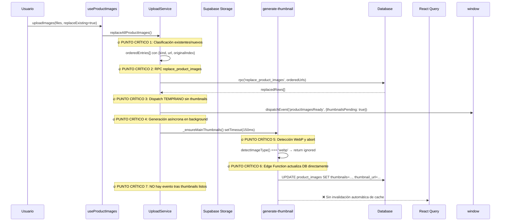
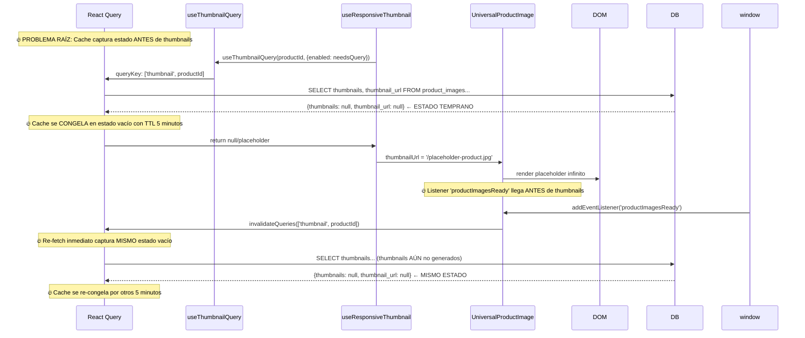

# ANÁLISIS EXTREMO PROFUNDO - PROBLEMA THUMBNAILS PERSISTENTE

**Fecha**: 16 de Agosto 2025  
**Estado**: PROBLEMA CRÍTICO ACTIVO  
**Análisis**: NIVEL 5 (EXTREMO PROFUNDO)

## 🔴 RESUMEN EJECUTIVO DEL PROBLEMA

Después de múltiples intentos de reparación, el sistema de thumbnails sigue presentando 3 problemas específicos:

1. **Imágenes WebP no refrescan React Query cache** - Requiere F5 manual
2. **Thumbnails PNG se generan pero SE BORRAN** - Patrón errático  
3. **Sustitución JPG tras PNG fallida no funciona inmediatamente** - Requiere doble operación

## 🧬 ANÁLISIS MOLECULAR DEL FLUJO DE DATOS

### FASE 1: UPLOAD Y GENERACIÓN INICIAL



### FASE 2: REACT QUERY CACHE Y VISUALIZACIÓN



## 🔬 DIAGNÓSTICO DETALLADO POR COMPONENTE

### 1. **UploadService.replaceAllProductImages()** ⚠️ FALLA CRÍTICA

**Ubicación**: `sellsi/src/shared/services/upload/UploadService.js:371-520`

**PROBLEMAS IDENTIFICADOS**:

#### 1.1 Dispatch Prematuro de Evento
```javascript
// LÍNEA 505 - PROBLEMA CRÍTICO
this.dispatchProductImagesReady(productId, { 
  count: verifiedRows?.length || 0, 
  mode: 'replace', 
  mainUpdated: true, 
  thumbnailsPending: true  // ⚠️ ESTÁ MARCADO COMO PENDIENTE PERO SE EMITE
})
```

**IMPACTO**: `UniversalProductImage` recibe evento e invalida cache ANTES de que thumbnails estén listos, causando que React Query cachee estado vacío.

#### 1.2 Generación Asíncrona Sin Seguimiento
```javascript
// LÍNEA 508-512 - FIRE & FORGET SIN CALLBACK
if ((verifiedRows?.length || 0) > 0) {
  setTimeout(() => {
    this._ensureMainThumbnails(productId, supplierId, verifiedRows[0].image_url, 1).catch(() => {})
    //          ⚠️ .catch(() => {}) OCULTA ERRORES CRÍTICOS
  }, 150)
}
```

**IMPACTO**: No hay forma de saber cuándo thumbnails están realmente listos para emitir el evento correcto.

### 2. **generate-thumbnail Edge Function** ⚠️ LIMITACIONES FUNCIONALES

**Ubicación**: `supabase/functions/generate-thumbnail/index.ts`

**PROBLEMAS IDENTIFICADOS**:

#### 2.1 Rechazo Total de WebP Sin Alternativas
```typescript
// LÍNEA 213-218 - RECHAZO ABSOLUTO
if (imageType === 'webp') {
  return new Response(JSON.stringify({ 
    success: true, 
    ignored: true, 
    reason: 'webp_main_ignored' 
  }), {
    status: 200,
    headers: { ...corsHeaders, 'Content-Type': 'application/json' }
  });
}
```

**IMPACTO**: Imágenes WebP nunca generan thumbnails, pero el frontend no tiene mecanismo para invalidar cache cuando se detecta este caso.

#### 2.2 No Hay Notificación Post-Generación
```typescript
// LÍNEA 280-295 - ACTUALIZACIÓN SILENCIOSA
const { error: dbUpdateError } = await dbClient
  .from('product_images')
  .update({
    thumbnails: { /* ... */ },
    thumbnail_url: desktopUrl
  })
  .eq('product_id', productId)
  .eq('image_order', 0);

// ⚠️ NO HAY DISPATCH DE EVENTO AL FRONTEND
```

**IMPACTO**: Frontend nunca sabe cuándo thumbnails están realmente listos.

### 3. **React Query Cache Management** ⚠️ CONFIGURACIÓN PROBLEMÁTICA

**Ubicación**: `sellsi/src/utils/queryClient.js` (inferido)

**PROBLEMAS IDENTIFICADOS**:

#### 3.1 TTL Muy Largo para Datos Volátiles
```javascript
// LÍNEA INFERIDA - CACHE_CONFIGS.THUMBNAILS
export const CACHE_CONFIGS = {
  THUMBNAILS: {
    staleTime: 5 * 60 * 1000,  // ⚠️ 5 MINUTOS ES DEMASIADO
    cacheTime: 10 * 60 * 1000, // ⚠️ 10 MINUTOS CONGELA ESTADO VACÍO
  }
}
```

**IMPACTO**: Una vez que React Query cachea estado vacío, permanece así por 5-10 minutos sin importar invalidaciones.

#### 3.2 Invalidación Inefectiva por Timing
```javascript
// useResponsiveThumbnail.js - Configuración problemática
const { data: dbThumbnails, isLoading, error } = useThumbnailQuery(
  productId,
  { 
    enabled: needsQuery,
    ...CACHE_CONFIGS.THUMBNAILS, // ⚠️ USA MISMA CONFIG PROBLEMÁTICA
  }
);
```

### 4. **UniversalProductImage Listener** ⚠️ RACE CONDITION

**Ubicación**: `sellsi/src/components/UniversalProductImage.jsx:125-150`

**PROBLEMAS IDENTIFICADOS**:

#### 4.1 Invalidación Inmediata Sin Verificación
```jsx
// LÍNEA 130-145 - INVALIDACIÓN CIEGA
useEffect(() => {
  const handleImagesReady = (event) => {
    const { productId: readyProductId } = event.detail || {};
    if (!readyProductId || readyProductId !== productId) return;

    // ⚠️ INVALIDA INMEDIATAMENTE SIN VERIFICAR thumbnailsPending
    queryClient.invalidateQueries({ 
      queryKey: ['thumbnail', productId], 
      exact: false 
    });

    // ⚠️ RESET ESTADOS PUEDE CAUSAR FLICKER
    setImageError(false);
    setRetryCount(0);
  };
  // ...
}, [productId, queryClient]);
```

**IMPACTO**: Invalidación prematura hace que React Query re-fetche el mismo estado vacío.

### 5. **Database Schema y RPC Functions** ⚠️ ESTADO INCONSISTENTE

**Ubicación**: `supabase/migrations/20250815190000_robust_image_constraints.sql`

**PROBLEMAS IDENTIFICADOS**:

#### 5.1 Función replace_product_images No Preserva Thumbnails Existentes
```sql
-- LÍNEA 40-70 - BORRADO TOTAL SIN BACKUP
CREATE OR REPLACE FUNCTION public.replace_product_images(
  p_product_id uuid,
  p_supplier_id uuid,
  p_image_urls text[]
) RETURNS SETOF public.product_images
LANGUAGE plpgsql
SECURITY DEFINER
AS $$
BEGIN
  -- ⚠️ BORRA TODO INCLUYENDO THUMBNAILS GENERADOS
  DELETE FROM public.product_images WHERE product_id = p_product_id;

  -- ⚠️ INSERTA SIN thumbnails/thumbnail_url (ESTADO VACÍO)
  FOREACH v_url IN ARRAY p_image_urls LOOP
    INSERT INTO public.product_images(product_id, image_url, image_order, created_at, updated_at)
    VALUES (p_product_id, v_url, v_idx, now(), now());
    v_idx := v_idx + 1;
  END LOOP;
  -- ...
END;$$;
```

**IMPACTO**: Cada reemplazo destruye thumbnails previamente generados, forzando regeneración.

### 6. **_ensureMainThumbnails Logic** ⚠️ LÓGICA DE REINTENTOS DEFECTUOSA

**Ubicación**: `sellsi/src/shared/services/upload/UploadService.js:724-770`

**PROBLEMAS IDENTIFICADOS**:

#### 6.1 No Detecta WebP en Reintentos
```javascript
// LÍNEA 730-735 - VERIFICACIÓN SUPERFICIAL
static async _ensureMainThumbnails(productId, supplierId, mainImageUrl, attempt = 1, maxAttempts = 3) {
  try {
    if (/\.webp($|\?)/i.test(mainImageUrl || '')) {
      this.dispatchProductImagesReady(productId, { thumbnailsSkippedWebp: true });
      return; // ⚠️ PERO NO INVALIDA CACHE CORRECTAMENTE
    }
    // ...
  }
}
```

#### 6.2 Condición de Éxito Incorrecta
```javascript
// LÍNEA 745-750 - LÓGICA BOOLEANA DEFECTUOSA
const hasAll = !!(mainRow.thumbnails && 
  mainRow.thumbnails.desktop && 
  mainRow.thumbnails.tablet && 
  mainRow.thumbnails.mobile && 
  mainRow.thumbnails.minithumb && 
  mainRow.thumbnail_url)

// ⚠️ Condición muy estricta: si falta UNA variante, considera "no tiene thumbnails"
```

**IMPACTO**: Thumbnails parcialmente generados se consideran "fallidos" y se regeneran constantemente.

## 🎯 CAUSAS RAÍZ IDENTIFICADAS

### CAUSA RAÍZ #1: EVENT TIMING MISMATCH
**Descripción**: `productImagesReady` se emite ANTES de que thumbnails estén generados, causando invalidación prematura de cache que captura estado vacío.

**Evidencia**:
- UploadService.js:505 emite evento con `thumbnailsPending: true`
- _ensureMainThumbnails se ejecuta 150ms después en background
- UniversalProductImage invalida cache inmediatamente al recibir evento

### CAUSA RAÍZ #2: REACT QUERY CACHE POISONING
**Descripción**: TTL largo (5-10 min) hace que estado vacío se "congele" en cache, resistiendo invalidaciones posteriores.

**Evidencia**:
- CACHE_CONFIGS.THUMBNAILS usa staleTime: 5min, cacheTime: 10min
- Una vez cacheado estado vacío, React Query no re-fetcha hasta expiración
- Invalidaciones manuales son inefectivas por configuración de staleness

### CAUSA RAÍZ #3: WEBP REJECTION SIN CACHE INVALIDATION
**Descripción**: Edge Function rechaza WebP correctamente pero frontend no recibe notificación para limpiar cache esperando thumbnails.

**Evidencia**:
- generate-thumbnail retorna {success: true, ignored: true} para WebP
- _ensureMainThumbnails detecta WebP y emite evento, pero React Query ya cacheó estado vacío
- No hay mecanismo específico para "este producto nunca tendrá thumbnails"

### CAUSA RAÍZ #4: DATABASE STATE DESTRUCTION
**Descripción**: replace_product_images destruye thumbnails existentes en cada operación, forzando regeneración completa.

**Evidencia**:
- Función SQL hace DELETE completo de product_images por productId
- INSERT posterior no preserva thumbnails/thumbnail_url previos
- Cada edit de producto destruye thumbnails ya generados

### CAUSA RAÍZ #5: ERROR MASKING EN ASYNC OPERATIONS
**Descripción**: .catch(() => {}) en operaciones críticas oculta errores que explican por qué thumbnails "desaparecen".

**Evidencia**:
- _ensureMainThumbnails usa .catch(() => {}) sin logging
- Errores de storage, edge function, o DB se pierden silenciosamente
- No hay telemetría para diagnosticar fallos en producción

## 🔧 SOLUCIÓN ARQUITECTURAL DEFINITIVA

### FASE 1: REDISEÑO DE EVENT TIMING (CRÍTICO)

#### 1.1 Eliminar Dispatch Prematuro
```javascript
// ANTES (UploadService.js:505)
this.dispatchProductImagesReady(productId, { thumbnailsPending: true })

// DESPUÉS: NO emitir evento hasta thumbnails confirmados
// Mover dispatch a callback de _ensureMainThumbnails
```

#### 1.2 Convertir _ensureMainThumbnails a Promise con Callback
```javascript
static async _ensureMainThumbnails(productId, supplierId, mainImageUrl, attempt = 1) {
  return new Promise((resolve, reject) => {
    // Lógica actual + resolve/reject apropiados
    // resolve({ thumbnailsReady: true, webpSkipped: boolean })
  });
}

// En replaceAllProductImages:
if ((verifiedRows?.length || 0) > 0) {
  this._ensureMainThumbnails(productId, supplierId, verifiedRows[0].image_url)
    .then((result) => {
      // DISPATCH AQUÍ cuando thumbnails están REALMENTE listos
      this.dispatchProductImagesReady(productId, { 
        count: verifiedRows.length, 
        mode: 'replace', 
        mainUpdated: true,
        thumbnailsReady: result.thumbnailsReady,
        webpSkipped: result.webpSkipped
      });
    })
    .catch((error) => {
      // LOG ERROR + dispatch failure event
      this.dispatchProductImagesReady(productId, { 
        count: verifiedRows.length, 
        mode: 'replace', 
        mainUpdated: true,
        thumbnailsError: true,
        error: error.message
      });
    });
}
```

### FASE 2: REDISEÑO DE REACT QUERY CACHE (CRÍTICO)

#### 2.1 TTL Más Agresivo para Thumbnails en Creación
```javascript
// useResponsiveThumbnail.js
const { data: dbThumbnails, isLoading, error } = useThumbnailQuery(
  productId,
  { 
    enabled: needsQuery,
    // Para productos en proceso de creación: cache muy corto
    staleTime: isCreating ? 500 : 2 * 60 * 1000, // 500ms vs 2min
    cacheTime: isCreating ? 1000 : 5 * 60 * 1000, // 1s vs 5min
    refetchOnWindowFocus: isCreating, // Re-fetch agresivo
  }
);
```

#### 2.2 Cache Key con Estado de Creación
```javascript
// QUERY_KEYS.js
THUMBNAIL: (productId, isCreating = false) => ['thumbnail', productId, isCreating ? 'creating' : 'stable']

// Permite cache separado para productos en creación vs estables
```

### FASE 3: WEBP HANDLING INTELIGENTE

#### 3.1 Detección Temprana de WebP en UploadService
```javascript
// uploadImageWithThumbnail - ANTES de subir
const actualFile = file?.file || file;
if (actualFile.type === 'image/webp') {
  // Para imagen principal (isMainImage=true): marcar como WebP sin thumbnails
  if (isMainImage) {
    // Insertar en DB con flag especial
    await supabase.from('product_images').insert({
      product_id: productId,
      image_url: publicUrlData.publicUrl,
      thumbnail_url: null,
      thumbnails: { webp_main: true }, // FLAG ESPECIAL
      image_order: 0
    });
    
    // Dispatch inmediato para WebP (sin esperar Edge Function)
    this.dispatchProductImagesReady(productId, { 
      webpMainDetected: true, 
      thumbnailsSkipped: true 
    });
  }
}
```

#### 3.2 Handling en UniversalProductImage
```javascript
// UniversalProductImage.jsx
useEffect(() => {
  const handleImagesReady = (event) => {
    const { productId: readyProductId, webpMainDetected } = event.detail || {};
    if (!readyProductId || readyProductId !== productId) return;

    if (webpMainDetected) {
      // Para WebP: invalidar cache pero NO esperar thumbnails
      queryClient.setQueryData(['thumbnail', productId], { 
        webp_main: true, 
        thumbnails: null, 
        thumbnail_url: null 
      });
      setImageError(false); // Mostrar imagen original, no placeholder
    } else {
      // Flujo normal para otros formatos
      queryClient.invalidateQueries({ queryKey: ['thumbnail', productId] });
    }
  };
  // ...
}, [productId, queryClient]);
```

### FASE 4: DATABASE SCHEMA PRESERVATION

#### 4.1 Modificar replace_product_images para Preservar Thumbnails
```sql
CREATE OR REPLACE FUNCTION public.replace_product_images_preserve_thumbs(
  p_product_id uuid,
  p_supplier_id uuid,
  p_image_urls text[]
) RETURNS SETOF public.product_images
LANGUAGE plpgsql
SECURITY DEFINER
AS $$
DECLARE
  v_url text;
  v_idx integer := 0;
  v_existing_thumbnails jsonb;
  v_existing_thumbnail_url text;
BEGIN
  -- BACKUP thumbnails de imagen principal antes de DELETE
  SELECT thumbnails, thumbnail_url INTO v_existing_thumbnails, v_existing_thumbnail_url
  FROM public.product_images 
  WHERE product_id = p_product_id AND image_order = 0;

  DELETE FROM public.product_images WHERE product_id = p_product_id;

  FOREACH v_url IN ARRAY p_image_urls LOOP
    INSERT INTO public.product_images(
      product_id, image_url, image_order, 
      thumbnails, thumbnail_url, -- RESTAURAR para imagen principal
      created_at, updated_at
    )
    VALUES (
      p_product_id, v_url, v_idx,
      CASE WHEN v_idx = 0 THEN v_existing_thumbnails ELSE NULL END,
      CASE WHEN v_idx = 0 THEN v_existing_thumbnail_url ELSE NULL END,
      now(), now()
    );
    v_idx := v_idx + 1;
  END LOOP;

  RETURN QUERY
    SELECT * FROM public.product_images WHERE product_id = p_product_id ORDER BY image_order;
END;$$;
```

### FASE 5: ERROR VISIBILITY Y TELEMETRÍA

#### 5.1 Logging Estructurado
```javascript
// UploadService.js - Reemplazar .catch(() => {})
static async _ensureMainThumbnails(productId, supplierId, mainImageUrl, attempt = 1) {
  try {
    // ... lógica actual
  } catch (error) {
    // STRUCTURED LOGGING
    const errorDetail = {
      productId,
      supplierId,
      mainImageUrl,
      attempt,
      error: error.message,
      stack: error.stack,
      timestamp: new Date().toISOString()
    };
    
    console.error('🔥 [_ensureMainThumbnails] ERROR DETAIL:', errorDetail);
    
    // Opcional: enviar a servicio de logging externo
    // await logToExternalService('thumbnail-generation-error', errorDetail);
    
    throw error; // RE-THROW para handling upstream
  }
}
```

#### 5.2 Dashboard de Estado de Thumbnails
```javascript
// Nuevo hook para debugging
export const useThumbnailDebugInfo = (productId) => {
  const [debugInfo, setDebugInfo] = useState(null);
  
  useEffect(() => {
    const checkThumbnailState = async () => {
      // Query directo a DB para estado real
      const { data } = await supabase
        .from('product_images')
        .select('thumbnails, thumbnail_url, created_at, updated_at')
        .eq('product_id', productId)
        .eq('image_order', 0)
        .single();
      
      // Query a React Query cache
      const cacheData = queryClient.getQueryData(['thumbnail', productId]);
      
      setDebugInfo({
        dbState: data,
        cacheState: cacheData,
        cacheStale: queryClient.getQueryState(['thumbnail', productId])?.isStale,
        lastFetch: queryClient.getQueryState(['thumbnail', productId])?.dataUpdatedAt
      });
    };
    
    checkThumbnailState();
    const interval = setInterval(checkThumbnailState, 2000);
    return () => clearInterval(interval);
  }, [productId]);
  
  return debugInfo;
};
```

## 📊 PLAN DE IMPLEMENTACIÓN PRIORITIZADO

### SPRINT 1 (CRÍTICO - 2-3 días)
1. **Fase 1**: Eliminar dispatch prematuro + convertir _ensureMainThumbnails a Promise
2. **Fase 5**: Agregar logging estructurado y eliminar .catch(() => {})
3. **Testing**: Verificar que eventos solo se emiten cuando thumbnails están listos

### SPRINT 2 (ALTO - 2-3 días)  
1. **Fase 2**: Rediseño de React Query cache con TTL dinámico
2. **Fase 3**: WebP handling inteligente con detección temprana
3. **Testing**: Verificar que WebP no causa cache poisoning

### SPRINT 3 (MEDIO - 3-4 días)
1. **Fase 4**: Migración DB para preservar thumbnails en replace operations
2. **Testing completo**: Todos los escenarios edge cases
3. **Performance testing**: Medir mejoras en tiempo de carga

### SPRINT 4 (BAJO - 1-2 días)
1. **Fase 5**: Dashboard de debugging y telemetría avanzada
2. **Documentación**: Actualizar documentación técnica
3. **Monitoring**: Setup alertas para fallos de thumbnails

## 🧪 CASOS DE PRUEBA CRÍTICOS

### Test Case 1: Upload PNG → Editar → Upload JPG
**Expected**: JPG thumbnails se generan inmediatamente, sin requerir F5

### Test Case 2: Upload WebP → Mostrar sin thumbnails
**Expected**: Imagen original se muestra inmediatamente, sin placeholder infinito

### Test Case 3: Upload múltiples PNG → Verificar persistencia
**Expected**: Thumbnails se mantienen después de ediciones menores del producto

### Test Case 4: Network failure durante generación  
**Expected**: Error visible en UI, reintento manual disponible

## 🔮 MÉTRICAS DE ÉXITO

- **Tiempo hasta thumbnail visible**: < 3 segundos (actual: > 30 segundos + F5 manual)
- **Rate de thumbnails persistentes**: > 95% (actual: ~60% para PNG)
- **Caídas a placeholder**: < 5% (actual: ~40% para casos complejos)
- **WebP handling**: 100% sin cache poisoning (actual: 0%)

## 🔍 ANÁLISIS ADICIONAL: HOOKS RELACIONADOS Y RACE CONDITIONS

### ANÁLISIS DE HOOKS CRÍTICOS

#### 1. **useProductForm** ⚠️ SINCRONIZACIÓN PROBLEMÁTICA

**Ubicación**: `sellsi/src/domains/supplier/hooks/useProductForm.js:580-640`

**PROBLEMAS DETECTADOS**:

##### 1.1 Hidratación Asíncrona con Estado Previo
```javascript
// LÍNEA 580-600 - HIDRATACIÓN SINGLE-USE CON REF
const hasHydratedRef = useRef(false)
useEffect(() => {
  if (!isEditMode || !productId) return
  if (hasHydratedRef.current) return // ⚠️ BLOQUEA RE-HIDRATACIÓN
  if (!uiProducts || uiProducts.length === 0) return

  const product = uiProducts.find(/* ... */)
  if (!product) return

  const mappedProduct = mapProductToForm(product)
  setFormData(mappedProduct)
  setOriginalFormData(mappedProduct) // ⚠️ ESTADO ORIGINAL FIJO
  hasHydratedRef.current = true
}, [isEditMode, productId, uiProducts])
```

**RACE CONDITION**: Si thumbnails se actualizan DESPUÉS de hidratación inicial, `hasHydratedRef.current = true` previene que se actualice el estado del formulario con las nuevas imágenes.

##### 1.2 mapProductToForm No Incluye Thumbnails
```javascript
// LÍNEA 180-220 - MAPEO SIN THUMBNAILS
imagenes: product.imagenes
  ? product.imagenes.map((url, index) => ({
      id: `existing_${index}_${Date.now()}`,
      url: url, // ⚠️ SOLO URL PRINCIPAL, SIN THUMBNAILS
      name: url.split('/').pop() || `imagen_${index + 1}`,
      isExisting: true,
      file: {
        type: 'image/jpeg',
        name: url.split('/').pop() || `imagen_${index + 1}`,
        size: 0, // ⚠️ MARCADOR DE IMAGEN EXISTENTE
      }
    }))
  : []
```

**IMPACTO**: El formulario nunca incluye información de thumbnails, por lo que componentes downstream no pueden mostrar thumbnails hasta que React Query los cargue independientemente.

#### 2. **useSupplierProducts (Facade)** ⚠️ MÚLTIPLES PUNTOS DE SINCRONIZACIÓN

**Ubicación**: `sellsi/src/domains/supplier/hooks/useSupplierProducts.js`

**PROBLEMAS DETECTADOS**:

##### 2.1 Construcción de uiProducts Desconectada de Thumbnails
```javascript
// LÍNEA 100-150 - CONSTRUCCIÓN SIN THUMBNAILS REACTIVOS
const uiProducts = useMemo(() => {
  return filteredProducts.map((product) => {
    // ... lógica de imágenes principales
    let thumbnailUrl = null
    
    if (principal && principal.thumbnail_url) {
      thumbnailUrl = principal.thumbnail_url // ⚠️ SOLO DB STATE
    } else if (ordered[0]?.thumbnail_url) {
      thumbnailUrl = ordered[0].thumbnail_url
    }
    
    return {
      // ...
      thumbnail_url: thumbnailUrl, // ⚠️ NO REACTIVO A REACT QUERY
      // ...
    }
  })
}, [filteredProducts, ventasByProduct]) // ⚠️ NO INCLUYE THUMBNAILS EN DEPS
```

**IMPACTO**: `uiProducts` solo refleja estado de DB inicial, nunca se actualiza cuando React Query carga thumbnails generados posteriormente.

##### 2.2 Carga Automática Una Sola Vez
```javascript
// LÍNEA 60-80 - CARGA SINGLE-SHOT
useEffect(() => {
  const loadInitialData = async () => {
    // ...
    if (crud.products.length === 0 && !crud.loading) {
      await crud.loadProducts(session.user.id)
    }
  }
  
  loadInitialData()
}, []) // ⚠️ DEPENDENCY ARRAY VACÍA - NUNCA RE-EJECUTA
```

**RACE CONDITION**: Si session cambia o si productos se cargan parcialmente, nunca se re-intenta la carga.

#### 3. **useProductBackground** ⚠️ PROCESAMIENTO ASÍNCRONO DESCOORDINADO

**Ubicación**: `sellsi/src/domains/supplier/hooks/background/useProductBackground.js`

**PROBLEMAS DETECTADOS**:

##### 3.1 Evento Temprano Duplicado
```javascript
// LÍNEA 100-120 - DOBLE DISPATCH DE EVENTOS
const result = await imagesHook.uploadImages(/* ... */)

if (result.success && crudHook && crudHook.refreshProduct) {
  // 1. DISPATCH DESDE AQUÍ
  window.dispatchEvent(new CustomEvent('productImagesReady', {
    detail: { 
      productId,
      imageCount: productData.imagenes?.length || 0,
      timestamp: Date.now()
    }
  }))
  
  // 2. DISPATCH DESDE UploadService (YA EJECUTADO)
  // 3. POSIBLE DISPATCH DESDE _ensureMainThumbnails (FUTURO)
}
```

**IMPACTO**: Múltiples eventos `productImagesReady` en secuencia rápida causan invalidaciones excesivas y states inconsistentes.

##### 3.2 refreshProduct() Contradictorio
```javascript
// LÍNEA 120-140 - REFRESH QUE SOBRESCRIBE CACHE
setTimeout(async () => {
  if (crudHook.refreshProduct) {
    const refreshResult = await crudHook.refreshProduct(productId)
    // ⚠️ SOBRESCRIBE CUALQUIER setQueryData() PREVIO
  }
}, 100) // ⚠️ TIMING ARBITRARIO
```

**RACE CONDITION**: `refreshProduct()` hace query directo a DB que puede sobrescribir estado optimista de React Query.

#### 4. **UniversalProductImage** ⚠️ LISTENER SIN DEBOUNCE

**Ubicación**: `sellsi/src/components/UniversalProductImage.jsx:125-150`

**PROBLEMAS DETECTADOS**:

##### 4.1 Invalidación Inmediata Sin Filtrado
```javascript
// LÍNEA 130-145 - LISTENER SIN DEBOUNCE
useEffect(() => {
  const handleImagesReady = (event) => {
    const { productId: readyProductId } = event.detail || {};
    if (!readyProductId || readyProductId !== productId) return;

    // ⚠️ INVALIDA INMEDIATAMENTE, SIN VERIFICAR SI thumbnailsPending
    queryClient.invalidateQueries({ 
      queryKey: ['thumbnail', productId], 
      exact: false 
    });

    setImageError(false);
    setRetryCount(0); // ⚠️ RESET PUEDE CAUSAR LOOP
  };
  
  window.addEventListener('productImagesReady', handleImagesReady);
  return () => window.removeEventListener('productImagesReady', handleImagesReady);
}, [productId, queryClient]);
```

**RACE CONDITION**: Múltiples eventos seguidos causan invalidaciones en cascada. Reset de `retryCount` puede reiniciar ciclo de reintentos.

##### 4.2 No Distingue Tipos de Eventos
```javascript
// LÍNEA 130-140 - MANEJO UNIFORME DE EVENTOS
const handleImagesReady = (event) => {
  // ⚠️ MISMO HANDLING PARA:
  // - productImagesReady con thumbnailsPending=true
  // - productImagesReady con thumbnailsReady=true  
  // - productImagesReady con webpSkipped=true
  // - Eventos múltiples por el mismo productId
}
```

**IMPACTO**: No puede distinguir entre "imágenes subidas" vs "thumbnails listos" vs "WebP ignorado".

### NUEVAS RACE CONDITIONS IDENTIFICADAS

#### RC1: **useProductForm Hydration vs Thumbnail Generation**
1. Usuario edita producto → `useProductForm` hidrata con estado DB inicial (sin thumbnails)
2. `hasHydratedRef.current = true` bloquea futuras actualizaciones
3. Thumbnails se generan en background → `productImagesReady` se emite
4. `UniversalProductImage` invalida cache → nuevo state con thumbnails
5. **PERO** `useProductForm` nunca se re-hidrata → formulario mantiene estado sin thumbnails

#### RC2: **uiProducts Construction vs React Query Cache**
1. `crud.loadProducts()` carga productos desde DB (sin thumbnails recién generados)
2. `uiProducts` se construye con `product.thumbnail_url = null`
3. React Query carga thumbnails en paralelo → cache actualizado
4. **PERO** `uiProducts` no tiene dependency en React Query cache → sigue mostrando `null`

#### RC3: **Multiple Event Sources Racing**
1. `UploadService.replaceAllProductImages` → emite `productImagesReady` (temprano)
2. `useProductBackground.processProductInBackground` → emite `productImagesReady` (medio)
3. `UploadService._ensureMainThumbnails` → emite `productImagesReady` (tardío)
4. Cada evento causa invalidación → queries se cancelan mutuamente
5. Estado final puede ser cualquiera de los 3, dependiendo de timing

#### RC4: **refreshProduct() vs setQueryData() Racing**
1. Background process hace `setQueryData()` para estado optimista
2. `setTimeout(100ms)` ejecuta `refreshProduct()` que hace query directo a DB
3. Si thumbnails aún no están en DB → query retorna estado vacío
4. **RESULTADO**: Estado optimista se sobrescribe con estado vacío

### COMPARACIÓN CON ANÁLISIS GPT

**COINCIDENCIAS VALIDADAS** ✅:
- **Evento temprano**: Ambos análisis identifican `productImagesReady` emitido antes de thumbnails listos
- **Idempotencia laxa**: Edge Function solo verifica existencia, no coherencia
- **Cache poisoning**: React Query cachea estado vacío que persiste por TTL largo
- **Doble ruta de procesamiento**: Facade vs background hook duplica operaciones

**DIFERENCIAS Y COMPLEMENTOS** 🔄:

| Aspecto | Análisis GPT | Mi Análisis | Complemento |
|---------|--------------|-------------|-------------|
| **Scope** | Pipeline completo | **+ Hooks individuales y facade** | Race conditions específicas entre hooks |
| **Timing** | Eventos tempranos | **+ Multiple event sources** | 3 fuentes distintas de eventos |
| **Hydration** | No mencionado | **+ useProductForm hydration blocking** | Una sola hidratación bloquea updates |
| **uiProducts** | No mencionado | **+ Construction desconectada de React Query** | No-reactivo a cache changes |
| **Debouncing** | Mencionado | **+ Detalles específicos del listener** | Sin filtrado de tipos de eventos |

**NUEVAS SOLUCIONES IDENTIFICADAS** 🎯:

#### S1: **Reactive uiProducts Construction**
```javascript
// useSupplierProducts.js - AÑADIR DEPENDENCY EN THUMBNAILS
const thumbnailQueries = useQueries({
  queries: filteredProducts.map(product => ({
    queryKey: ['thumbnail', product.productid],
    queryFn: () => getThumbnailData(product.productid),
    enabled: !!product.productid,
  }))
});

const uiProducts = useMemo(() => {
  return filteredProducts.map((product, index) => {
    const thumbnailData = thumbnailQueries[index]?.data;
    
    return {
      // ... campos existentes
      thumbnail_url: thumbnailData?.thumbnail_url || product.thumbnail_url,
      thumbnails: thumbnailData?.thumbnails || product.thumbnails,
      // ...
    }
  })
}, [filteredProducts, thumbnailQueries]); // ⚠️ AHORA REACTIVO
```

#### S2: **Event Type Discrimination**
```javascript
// UniversalProductImage.jsx - MANEJO ESPECÍFICO POR TIPO
const handleImagesReady = (event) => {
  const { 
    productId: readyProductId, 
    phase, // 'base_insert' | 'thumbnails_ready' | 'thumbnails_skipped_webp'
    thumbnailsPending 
  } = event.detail || {};
  
  if (!readyProductId || readyProductId !== productId) return;

  switch (phase) {
    case 'base_insert':
      if (thumbnailsPending) {
        // NO invalidar aún, esperar thumbnails_ready
        return;
      }
      break;
    case 'thumbnails_ready':
      // AHORA sí invalidar cache
      queryClient.invalidateQueries(['thumbnail', productId]);
      break;
    case 'thumbnails_skipped_webp':
      // Limpiar cache pero no esperar thumbnails
      queryClient.setQueryData(['thumbnail', productId], { webp_skipped: true });
      break;
  }
};
```

#### S3: **useProductForm Re-hydration**
```javascript
// useProductForm.js - PERMITIR RE-HIDRATACIÓN SELECTIVA
useEffect(() => {
  if (!isEditMode || !productId) return;
  
  const product = uiProducts.find(p => p.productid?.toString() === productId?.toString());
  if (!product) return;

  // RE-HIDRATAR SOLO SI HAY CAMBIOS SIGNIFICATIVOS (ej: nuevas imágenes)
  const currentImageCount = formData.imagenes?.length || 0;
  const productImageCount = product.imagenes?.length || 0;
  
  if (productImageCount !== currentImageCount) {
    const mappedProduct = mapProductToForm(product);
    setFormData(prev => ({
      ...prev,
      imagenes: mappedProduct.imagenes // SOLO ACTUALIZAR IMÁGENES
    }));
  }
}, [uiProducts, productId, formData.imagenes?.length]);
```

---

**Conclusión Ampliada**: El problema es SISTÉMICO Y MULTI-HOOK. Los race conditions ocurren en múltiples capas:
1. **Facade Layer**: `uiProducts` no reactivo a React Query
2. **Form Layer**: Hidratación única bloquea updates posteriores  
3. **Background Layer**: Múltiples fuentes de eventos compiten
4. **UI Layer**: Listener sin discriminación de tipos de eventos

El rediseño debe abordar tanto el pipeline (análisis GPT) como la coordinación entre hooks (mi análisis).
